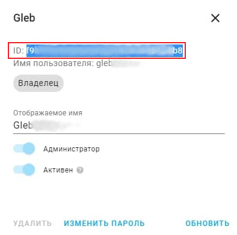

[](https://github.com/custom-components/hacs)

## Yandex Smart Home custom component for Home Assistant

### Installation

1. Configure SSL certificate if it was not done already (do not use self-signed certificate)
1. Update home assistant to 2021.4 at least
1. Install [HACS](https://hacs.xyz/) and search for "Yandex Smart Home" there. That way you get updates automatically. But you also can just copy and add files into custom_components directory manually instead
1. Configure component via configuration.yaml (see instructions below)
1. Restart home assistant
1. Create dialog via https://dialogs.yandex.ru/developer/
1. Add devices via your Yandex app on android/ios

### Configuration

Now add the following lines to your `configuration.yaml` file:

```yaml
# Example configuration.yaml entry
yandex_smart_home:
  notifier:
    oauth_token: AgAAAAAEEo2aYYR7m-CEyS7SEiUJjnKez3v3GZe
    skill_id: d38d4c39-5846-ba53-67acc27e08bc
    user_id: e8701ad48ba05a91604e480dd60899a3
  settings:
    pressure_unit: mmHg
  filter:
    include_domains:
      - switch
      - light
    include_entities:
      - media_player.tv
      - media_player.tv_lg
      - media_player.receiver
    exclude_entities:
      - light.highlight
  entity_config:
    switch.kitchen:
      name: CUSTOM_NAME_FOR_YANDEX_SMART_HOME
    light.living_room:
      room: LIVING_ROOM
    light.led_strip:
      modes:
        scene:
          sunrise:
            - Wake up
          alarm:
            - Blink
    media_player.tv_lg:
      channel_set_via_media_content_id: true
    fan.xiaomi_miio_device:
      name: "Увлажнитель"
      room: LIVING_ROOM
      type: devices.types.humidifier
      properties:
        - type: temperature
          entity: sensor.temperature_158d000444c824
        - type: humidity
          attribute: humidity
        - type: water_level
          attribute: depth
    climate.tion_breezer:
      name: "Проветриватель"
      modes:
        fan_speed:
          auto: [auto]
          min: [1,'1.0']
          low: [2,'2.0']
          medium: [3,'3.0']
          high: [4,'4.0']
          turbo: [5,'5.0']
          max: [6,'6.0']
    media_player.receiver:
      type: devices.types.media_device.receiver
      relative_volume_only: false
      range:
        max: 95
        min: 20
        precision: 2
    humidifier.bedroom:
      modes:
        program:
          normal:
            - normal
          eco:
            - away
      properties:
        - type: temperature
          entity: sensor.bedroom_temperature
        - type: humidity
          entity: sensor.bedroom_humidity
        - type: water_level
          entity: sensor.humidifier_level
```

Configuration variables:

```yaml
yandex_smart_home:
  (map) (Optional) Configuration options for the Yandex Smart Home integration.

  notifier:
    (map) (Optional) Device status change notification settings.
    oauth_token: 
      (string) (Optional) Your Yandex Dialogs OAuth Token.
    skill_id:
      (string) (Optional) Your Skill ID. Get it at Yandex Dialogs.
    user_id:
      (string) (Optional) 32-digit User ID under which you autorized and linked your dialog with Home Assistant.
  settings:
    (map) (Optional) Various settings that affect this integration.
    pressure_unit:
      (string) (Optional) Pressure unit to use when exposing pressure entities, available units: pa, mmHg (default), atm, bar
      Value conversion is done automatically from 'hPa' or 'mbar' that Home Assistant supports.

  filter:
    (map) (Optional) description: Filters for entities to include/exclude from Yandex Smart Home.
    include_entities:
      (list) (Optional) description: Entity IDs to include.
    include_domains:
      (list) (Optional) Domains to include.
    exclude_entities:
      (list) (Optional) Entity IDs to exclude.
    exclude_domains:
      (list) (Optional) Domains to exclude.

  entity_config:
    (map) (Optional) Entity specific configuration for Yandex Smart Home.
    ENTITY_ID:
      (map) (Optional) Entity to configure.
      name:
        (string) (Optional) Name of entity to show in Yandex Smart Home.
      room:
        (string) (Optional) Associating this device to a room in Yandex Smart Home
      type:
        (string) (Optional) Allows to force set device type. For example set devices.types.purifier to display device as purifier (instead default devices.types.humidifier for such devices) 
      channel_set_via_media_content_id:
        (boolean) (Optional) (media_player only) Enables ability to set channel
         by number for 
        part of TVs (TVs that support channel change via passing number as media_content_id)
      relative_volume_only:
        (boolean) (Optional) (media_player only) Force disable ability to get/set volume by number
      properties:
        - type:
            (string) (Optional) Sensor type, available types: humidity, temperature, pressure, water_level, co2_level, power, voltage, battery_level, amperage
          entity:
            (string) (Optional) Custom entity, any sensor can be added 
          attribute:
            (string) (Optional) Attribute of an object to receive data
      range: (Optional)
        max:
          (float) (Optional) Range Maximum
        min:
          (float) (Optional) Range Minimum
        precision:
          (float) (Optional) Range Precision (adjustment step)
      modes:
        (map) (Optional) Map of yandex mode functions (https://yandex.ru/dev/dialogs/alice/doc/smart-home/concepts/mode-instance-docpage/)
        fan_speed|cleanup_mode|program|scene|thermostat|swing:
          (map) (Optional) Map of yandex modes (https://yandex.ru/dev/dialogs/alice/doc/smart-home/concepts/mode-instance-modes-docpage/) to HA modes.
          Map of scene mode - https://yandex.ru/dev/dialogs/smart-home/doc/concepts/color_setting.html#discovery__discovery-parameters-color-setting-table__entry__75 
          yandex_mode1:
            - ha_mode1
          yandex_mode2: [ha_mode2, ha_mode2b]
```

### Available domains

The following domains are available to be used:

- climate (on/off, temperature, mode, fan speed) (properties: temperature , humidity)
- cover (on/off = close/open)
- fan (on/off, fan speed, oscillation)
- group (on/off)
- input_boolean (on/off)
- scene (on/off)
- script (on/off)
- light (on/off, brightness, color, color temperature)
- media_player (on/off, mute/unmute, volume, input_source, pause/unpause, channels: up/down as prev/next 
track, get/set media_content_id via channel number for part of TVs(enabled 
via extra option "channel_set_via_media_content_id: true" in entity 
configurations))
- switch (on/off)
- vacuum (on/off, pause/unpause, clean speed) (properties: battery)
- water_heater (on/off, temperature)
- lock (on/off = lock/unlock)
- sensor (properties: temperature, humidity, pressure)
- humidifier (on/off, mode, target humidity)

### Room/Area support

Entities that have not got rooms explicitly set and that have been placed in Home Assistant areas will return room hints to Yandex Smart Home with the devices in those areas.

### Create Dialog

Go to https://dialogs.yandex.ru/developer/ and create smart home skill.

Field | Value
------------ | -------------
Endpoint URL | https://[YOUR HOME ASSISTANT URL:PORT]/api/yandex_smart_home

For account linking use button at the bottom of skill settings page, fill it
 using values like below:

Field | Value
------------ | -------------
Client identifier | https://social.yandex.net/
API authorization endpoint | https://[YOUR HOME ASSISTANT URL:PORT]/auth/authorize
Token Endpoint | https://[YOUR HOME ASSISTANT URL:PORT]/auth/token
Refreshing an Access Token | https://[YOUR HOME ASSISTANT URL:PORT]/auth/token

### State changing notification

If you want to notify Yandex Smart Home about a change in the state of your devices, you need to configure three parameters: [OAuth token](https://oauth.yandex.ru/authorize?response_type=token&client_id=c473ca268cd749d3a8371351a8f2bcbd), [skill ID](https://dialogs.yandex.ru/developer), and Home Assistant user ID (https://[YOUR HOME ASSISTANT URL:PORT]/config/users) to which the skill is linked.



User ID is not the same as Home Assistant username. This is a 32-digit identifier that can be found by selecting the desired user in the settings.
```
yandex_smart_home:
  notifier:
    oauth_token: XXXXXXXXXXXXXXXXXXXXXXXXXXX
    skill_id: xxxxxxxx-xxxx-xxxx-xxxxxxxxxxxx
    user_id: xxxxxxxxxxxxxxxxxxxxxxxxxxxx
```
If you need to notify multiple skills, you can enter their details in a list.
```
yandex_smart_home:
  notifier:
    - oauth_token: XXXXXXXXXXXXXXXXXXXXXXXXXXX
      skill_id: xxxxxxxx-xxxx-xxxx-xxxxxxxxxxxx
      user_id: xxxxxxxxxxxxxxxxxxxxxxxxxxxx
    - oauth_token: YYYYYYYYYYYYYYYYYYYYYYYYYYY
      skill_id: yyyyyyyy-yyyy-yyyy-yyyyyyyyyyyy
      user_id: yyyyyyyyyyyyyyyyyyyyyyyyyyyy
```

## Usefull links
* https://github.com/allmazz/yandex_smart_home_ip
