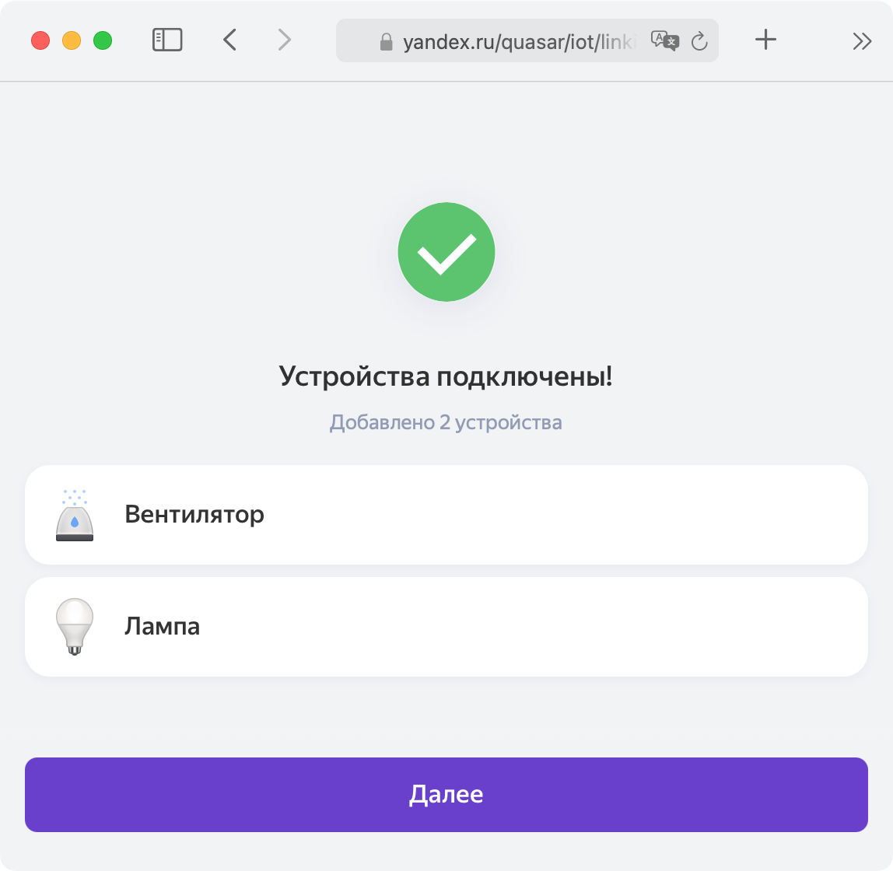
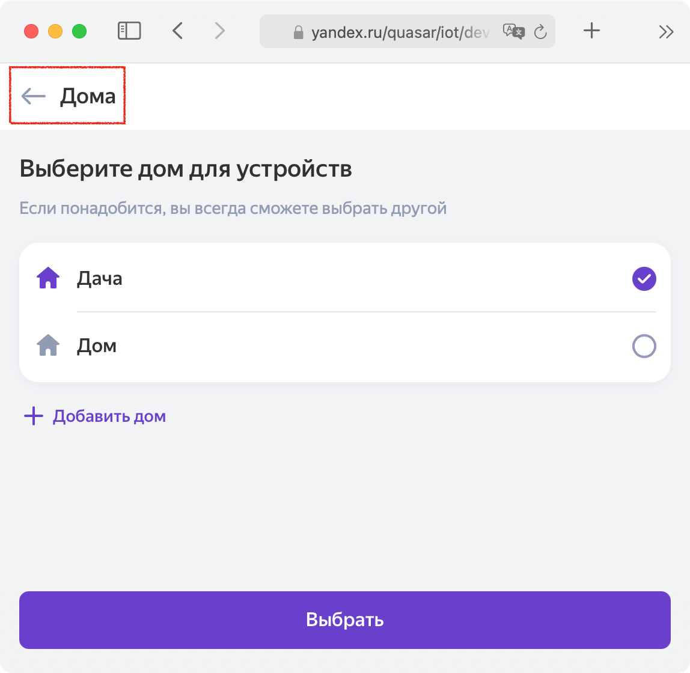
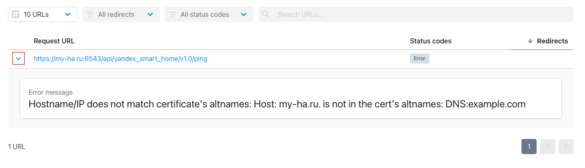

[](https://github.com/custom-components/hacs)
[](https://codecov.io/gh/dmitry-k/yandex_smart_home)

# Компонент Yandex Smart Home для Home Assistant
Компонент позволяет добавить устройства из Home Assistant в платформу [умного дома Яндекса](https://yandex.ru/dev/dialogs/smart-home) (УДЯ)
и управлять ими с любого устройства с Алисой: умные колонки, приложение на телефоне, веб интерфейс ["квазар"](https://yandex.ru/quasar/iot).

- [Предварительные требования](#предварительные-требования)
- [Установка](#установка)
- [Настройка](#настройка)
- [Фильтрация устройств](#фильтрация-устройств)
- [Тонкая настройка устройств](#тонкая-настройка-устройств)
  - [Поддержка комнат](#поддержка-комнат)
  - [Настройка режимов/функций](#настройка-режимовфункций)
    - [thermostat](#thermostat)
    - [swing](#swing)
    - [program](#program)
    - [fan_speed](#fan_speed)
    - [fan_speed (скорость в процентах)](#fan_speed-скорость-в-процентах)
    - [cleanup_mode](#cleanup_mode)
    - [input_source](#input_source)
    - [scene](#scene)
  - [Пользовательские умения](#пользовательские-умения)
    - [Умения "Режимы работы" (custom_modes)](#умения-режимы-работы-custom_modes)
      - [Примеры](#примеры)
    - [Умения "Переключатели" (custom_toggles)](#умения-переключатели-custom_toggles)
      - [Примеры](#примеры-1)
    - [Умения "Выбор значения из диапазона" (custom_ranges)](#умения-выбор-значения-из-диапазона-custom_ranges)
      - [Примеры](#примеры-2)
  - [Датчики](#датчики)
  - [Режим включения кондиционеров и термостатов](#режим-включения-кондиционеров-и-термостатов)
  - [Ограничение уровня громкости](#ограничение-уровня-громкости)
- [Уведомления об изменении состояний устройств](#уведомления-об-изменении-состояний-устройств)
- [Прочие настройки](#прочие-настройки)
- [Проблемы](#проблемы)
  - [Яндекс не может достучаться до Home Assistant](#яндекс-не-может-достучаться-до-home-assistant)
  - [Устройство не появляется в УДЯ](#устройство-не-появляется-в-удя)
  - [Ошибки при публикации навыка](#ошибки-при-публикации-навыка)
    - [Превышено время ожидания ответа](#превышено-время-ожидания-ответа)
  - [Ошибка "Что-то пошло не так" при частых действиях](#ошибка-что-то-пошло-не-так-при-частых-действиях)
  - [Как отвязать диалог](#как-отвязать-диалог)
  - [Появляются дубли устройств](#появляются-дубли-устройств)
- [Полезные ссылки](#полезные-ссылки)
- [Пример конфигурации](#пример-конфигурации)


## Предварительные требования
* Home Assistant версии 2021.7 или новее.
* Доступность Home Assistant из интернета по **доменному имени** используя белый IP адрес или
  сторонние сервисы: [Dataplicity](https://github.com/AlexxIT/Dataplicity), [KeenDNS](https://keenetic.link).
* Настроенный HTTPS сертификат. Для белого IP адреса можно воспользоваться официальным аддоном Let's Encrypt.
  При использовании Dataplicity или KeenDNS HTTPS настраивается автоматически. Самоподписанные сертификаты работать не будут.


## Установка
**Способ 1:** [HACS](https://hacs.xyz/)
> HACS > Интеграции > Добавить > Yandex Smart Home > Установить

**Способ 2:** Вручную скопируйте папку `custom_components/yandex_smart_home` из [latest release](https://github.com/dmitry-k/yandex_smart_home/releases/latest) в директорию `/config/custom_components`


## Настройка
Все настройки выполняются через конфигурационный файл. После изменений в файлах не забывайте перезапускать компонент через страницу "Интеграции" в Home Assistant (или через "Настройки" -> "Управление сервером").

* Для базовой настройки компонента добавьте строку `yandex_smart_home:` в файл `configuration.yaml` и перезапустите Home Assistant.
  Если у вас много устройств, или вы хотите отдавать в УДЯ только некоторые, **рекомендуется сразу** [настроить фильтры](#фильтрация-устройств).
* [Проверьте доступность HA из интернета и корректность настройки компонента](#яндекс-не-может-достучаться-до-home-assistant)
* Зайдите на [dialogs.yandex.ru](https://dialogs.yandex.ru) и создайте диалог (навык) с типом "Умный дом".
  Желательно это делать из под аккаунта, который планируется использовать для управления умным домом.
  При необходимости доступ к диалогу можно предоставить другим пользователям Яндекса (вкладка Доступ).
  * Вкладка "Настройки":
    | Поле              | Значение     |
    | ----------------- | ------------ |
    | Backend           | Endpoint URL: `https://[YOUR_HA_DOMAIN:PORT]/api/yandex_smart_home` (пример: `https://XXXX.dataplicity.io/api/yandex_smart_home`) |
    | Тип доступа       | Приватный    |
    | Подзаголовок      | Любой        |
    | Имя разработчика  | Любое        |
    | Официальный навык | Нет          |
    | Описание          | Любое        |
    | Иконка            | Любая (например [эта](https://community-assets.home-assistant.io/original/3X/6/a/6a99ebb8d0b585a00b407123ff76964cb3e18780.png)) |


  * Вкладка "Связка аккаунтов":
    | Поле                        | Значение                                          |
    | --------------------------- | ------------------------------------------------- |
    | Идентификатор приложения    | https://social.yandex.net/                        |
    | Секрет приложения           | Любой, например: `secret`                         |
    | URL авторизации             | `https://[YOUR_HA_DOMAIN:PORT]/auth/authorize`    |
    | URL для получения токена    | `https://[YOUR_HA_DOMAIN:PORT]/auth/token`        |
    | URL для обновления токена   | `https://[YOUR_HA_DOMAIN:PORT]/auth/token`        |

* На вкладке "Настройки" **обязательно нажмите** "Опубликовать" (для приватных навыков публикация автоматическая и моментальная). **Не используйте навык в режиме "Черновик"**, это может вызывать различные проблемы (дубли уcтройств, ошибки в нотификаторе).
  В этот момент УДЯ попробует подключиться к вашему Home Assistant, и если у него не получится - появятся [ошибки валидации](#ошибки-при-публикации-навыка).
* В приложении Яндекс на Android/iOS (или в [квазаре](https://yandex.ru/quasar/iot)) добавьте устройства умного дома,
  в производителях выберите диалог, который создали ранее (ищите по названию).
* Должна произойти переадресация на страницу авторизации Home Assistant. Рекомендуется создать отдельного пользователя
  специально для УДЯ и авторизоваться под ним. В этом случае в журнале событий будет видно, когда устройством управлял Яндекс.
* Настоятельно рекомендуется настроить [уведомления об изменении состояний](#уведомления-об-изменении-состояний-устройств).


## Фильтрация устройств
По умолчанию в УДЯ отдаются все поддерживаемые компонентом устройства (в том числе из доменов `script` и `scene`).
Отфильтровать устройства можно через словарь `filter`.

Поддерживаемые фильтры: `include_domains`, `include_entities`,
`include_entity_globs`, `exclude_domains`, `exlude_entities`, `exclude_entity_globs`.

Приоритизация по фильтрам работает аналогично фильтрам в интеграции [Recorder](https://www.home-assistant.io/integrations/recorder/#configure-filter).

Фильтры используется только при добавлении новых устройств в УДЯ. Если устройство уже добавлено в УДЯ, его исключение
с помощью фильтров не даст никакого эффекта и устройства потребуется удалять из УДЯ вручную. Поэтому фильтры лучше настраивать сразу, особенно если в Home Assistant много устройств.

Пример конфигурации:
```yaml
yandex_smart_home:
  filter:
    include_domains:
      - switch
      - light
    include_entities:
      - media_player.tv
      - media_player.tv_lg
      - media_player.receiver
    include_entity_globs:
      - sensor.temperature_*
    exclude_entities:
      - light.highlight
    exclude_entity_globs:
      - sensor.weather_*
```


## Тонкая настройка устройств
Для каждого устройства можно задать индивидуальные параметры для изменения некоторых значений по умолчанию.
Выполняется через словарь `entity_config`.

Наличие устройства в `entity_config` не означает, что оно будет отдано в УДЯ. Не забудьте разрешить устройство в фильтрах.

| Параметр      | По умолчанию    | Варианты                          | Описание                                                 |
| ------------- | --------------- | --------------------------------- | -------------------------------------------------------- |
| `name`        |                 | Русские буквы и пробелы           | Отображаемое название устройства
| `room`        |                 | Русские буквы и пробелы           | Комната, в которой находится устройство, [подробнее о комнатах...](#поддержка-комнат)
| `type`        | Автоматически   | [Список](https://yandex.ru/dev/dialogs/smart-home/doc/concepts/device-types.html#device-types__types) | Переопредление стандартного типа устройства. Например домен `switch` по умолчанию отдается как "выключатель" (`devices.types.switch`) и реагирует на команду "Алиса, включи ХХХ". А если задать `devices.types.openable`, то у такого устройства изменится иконка и фраза на "Алиса, **открой** XXX"
| `turn_on`     | Автоматически   |                                   | Вызываемый сервис при включении устройства               |
| `turn_off`    | Автоматически   |                                   | Вызываемый сервис при выключении устройства              |
| `features`    |                 | `volume_mute`, `volume_set`, `next_previous_track` | Только для домена `media_player`. Явное указание поддерживаемых устройством функций. Использутся для устройств, которые меняют набор функций в зависимости от своего состояния (например Chrome Cast).
| `channel_set_via`<br>`_media_content_id` | `false` | `true` / `false`  | Только для домена `media_player`. Выбор конкретного канала через `media_content_id`, [подробнее...](https://github.com/dmitry-k/yandex_smart_home/issues/36). Если у вас телевизор подключен через **SmartIR**, скорее всего вам нужно включить этот параметр.

Пример конфигурации:
```yaml
yandex_smart_home:
  entity_config:
    fan.xiaomi_miio_device:
      name: Увлажнитель
      room: Гостинная
      type: devices.types.humidifier
    switch.gate:
      name: Ворота
      room: Улица
      type: devices.types.openable
    climate.smart_ir:
      name: Кондиционер
      room: Кухня
      turn_on:
        service: climate.turn_on
        entity_id: climate.smart_ir
```


### Поддержка комнат
Если для устройства заданы `name` и `room` УДЯ при обновлении списка устройств автоматически добавит его в нужную комнату.

Важные уточнения:
1. Комната уже должна существовать.
2. При ручном обновлении устройств (или при первичной настройке) важно **не выбирать** "Дом", а просто понажимать стрелку "Назад":

|  |  |
|:---:|:---:|
| Нажать "Далее" | **Не нажимать** "Выбрать", вместо этого нажимать стрелку назад |


### Настройка режимов/функций
Для некоторых устройств в УДЯ предусмотрено управление режимами. Типичные примеры - охлаждение/нагрев/осушение для кондиционера,
или низкая/средняя скорость вращения для вентилятора.

[Список режимов](https://yandex.ru/dev/dialogs/smart-home/doc/concepts/mode-instance-modes.html) в УДЯ фиксированный,
поэтому их необходимо связывать со значениями атрибутов в Home Assistant. Для большинства устройств этот процесс (маппинг)
происходит **автоматически**, но в некоторых случаях это требуется сделать вручную через параметр `modes` в `entity_config`.

Со стороны УДЯ нет жесткой привязки значений режимов к типам устройств. Другими словами, у режима "Скорость вентиляции"
(`fan_speed`) значения могут быть не только "низкое", "высокое", но и совсем от другого типа устройств, например "дичь" или "эспрессо".

Если маппинг не удался - управление функцией через УДЯ будет недоступно.

Пример конфигурации:
```yaml
yandex_smart_home:
  entity_config:
    light.led_strip:
      modes:
        scene:
          sunrise:
            - Wake up
          alarm:
            - Blink
    climate.some_ac:
      modes:
        fan_speed:
          auto: [auto]
          min: ['1','1.0']
          turbo: ['5','5.0']
          max: ['6','6.0']
        swing:
          auto: ['SWING']
          stationary: ['OFF']
```

* `scene`, `fan_speed`, `swing` - режим/функция со стороны УДЯ
* `auto`, `stationary`, `alarm` - значение режима со стороны УДЯ ([все возможные значения](https://yandex.ru/dev/dialogs/smart-home/doc/concepts/mode-instance-modes.html))
* Списки значений (`Wake Up`, `Swing` и т.п.) - значения атрибута сущности в Home Assistant, которое соответствует значению режима в УДЯ.
  Задавать лучше строками в кавычках.

Ниже детальная информация по поддерживаемым режимам и их значениям.


#### thermostat
Установка температурного режима работы климатической техники, например, в кондиционере.

* Поддерживаемые домены: `climate`
* Рекомендуемые значения режимов: `heat`, `cool`, `auto`, `dry`, `fan_only`
* Атрибут в Home Assistant: `hvac_modes`

#### swing
Установка направления воздуха в климатической технике.

* Поддерживаемые домены: `climate`
* Рекомендуемые значение режимов: `vertical`, `horizontal`, `stationary`, `auto`
* Атрибут в Home Assistant: `swing_modes`

#### program
Установка какой-либо программы работы.

* Поддерживаемые домены: `humidifier`, `fan`
* Рекомендуемые значения режимов: `normal`, `eco`, `min`, `turbo`, `medium`, `max`, `quiet`, `auto`, `high`
* Атрибут в Home Assistant:
  * `humidifier`: `available_modes`
  * `fan`: `preset_modes` (если поддерживается установка скорости в процентах)

#### fan_speed
Установка режима работы скорости вентиляции, например, в кондиционере, вентиляторе или обогревателе.

* Поддерживаемые домены: `fan`, `climate`
* Рекомендуемые значения режимов: `auto`, `quiet`, `low`, `medium`, `high`, `turbo`
* Атрибут в Home Assistant:
  * `fan`: `preset_modes` (если не поддерживается установка скорости в процентах, сервис `fan.set_speed_percentage`)
  * `fan`: `speed_list` (сли не поддерживается установка скорости в процентах и режимы, устарело)
  * `climate`: `fan_modes`

#### fan_speed (скорость в процентах)
Некоторые вентиляторы позволяют устанавливать скорость вентиляции в процентах, используя сервис `fan.set_speed_percentage`. Для таких вентиляторов компонент автоматически соотнесёт режим в УДЯ и скорость в процентах для режима "Скорость вентиляции".

Автоматическое соотношение можно переопределить путём указания числа с процентами в качестве режима со стороны HA в конфигурации устройства. Пример:
```yaml
yandex_smart_home:
  entity_config:
    fan.xiaomi:
      modes:
        fan_speed:
          low: ['10%']  # округляйте до целого
          normal: ['50%']
```

Рекомендуемые значения режимов: `eco`, `quiet`, `low`, `medium`, `normal`, `high`, `turbo`

#### cleanup_mode
Установка режима уборки.

* Поддерживаемые домены: `vacuum`
* Рекомендуемые значения режимов: `auto`, `turbo`, `min`, `max`, `express`, `normal`, `quiet`
* Атрибут в Home Assistant: `fan_speed_list`

#### input_source
Установка источника сигнала.

* Поддерживаемые домены: `media_player`
* Рекомендуемые значения режимов: `one`, `two`, `three`, `four`, `five`, `six`, `seven`, `eight`, `nine`, `ten`
* Атрибут в Home Assistant: `source_list`

#### scene
Изменение режима работы светящихся элементов устройства в соответствии с предустановленными темами и сценариями освещения.

* Поддерживаемые домены: `light`
* Значения режимов: `alarm`, `alice`, `candle`, `dinner`, `fantasy`, `garland`, `jungle`, `movie`, `neon`, `night`, `ocean`, `party`, `reading`, `rest`, `romance`, `siren`, `sunrise`, `sunset` (список фиксированный, другими значениями не расширяется)
* Атрибут в Home Assistant: `effect_list`


### Пользовательские умения
Иногда возможностей компонента недостаточно и хочется добавить свои функции, переключатели и регулировки.
Это можно сделать через "пользовательские умения" для каждого устройства отдельно через `entity_config`.

**Важно!** Пользовательские умения являются приоритетными и перекрывают встроенные в компонент.

Поддерживается несколько вида пользовательских умений:
* Режимы (`mode`) - переключение режимов работы устройства (режим работы кондиционера, уборки, источника сигнала и т.п.).
  Настраиваются через словарь `custom_modes`.
* Переключатели (`toggle`) - управление функциями, которые включаются и выключаются (пауза, вращение вентилятора, ионизация и т.п.).
  Настраиваются через словарь `custom_toggles`.
* Выбор из диапазона (`range`) - управление параметрами устройства, которые имеют диапазон (яркость лампы, громкость звука, температура нагревателя).
  Настраиваются через словарь `custom_ranges`.

В каждое умение входит ряд функций (например функция `volume` в умении `range`). Для одного устройства может быть **несколько** функций в разных умениях (или в одном). Дубликаты фукнций невозможны (т.е. `volume` может быть только одна для одного устройства).
Функции никак не привязаны к типу устройства, а это значит, что функция "громкость" может быть, например, у выключателя или увлажнителя. Это позволяет реализовывать **[безумный набор умений](https://github.com/dmitry-k/yandex_smart_home/blob/master/quasar_crazy_caps.png)** в одном устройстве.

Для всех умений есть общие и специфичные параметрами. Специфичные параметры смотрите в разделе посвящённому конкретному умению.

Общие параметры:
* `state_entity_id`: Сущность в состоянии или атрибуте которой хранится текущее значение умения (громкость, яркость, режим и т.п.).
  По умолчанию та, для которой настраивается пользовательское умение.
* `state_attribute`: Атрибут, в котором хранится текущее значение умения. Если не задан - значение берётся из состояния.


#### Умения "Режимы работы" (custom_modes)
Выбирает режим работы устройства, при изменении которого будут выполняться произвольные сервисы. Смотрите список **[всех доступных функций](https://yandex.ru/dev/dialogs/smart-home/doc/concepts/mode-instance.html)**.

Примеры: коферка, которая варит кофе скриптом `script.makemeonecupofcoffee` или моющий ылесос Xiaomi, в котором хочется управлять количеством подаваемой воды через сервис `xiaomi_vacuum.set_water_level`.

Для пользовательского режима автоматического связывание между значениями УДЯ и Home Assistant не производится. Вам нужно
вручную задать соответствия через `modes`!

Специфичные параметры:
* `set_mode`: Вызываемый сервис при выборе режима в УДЯ. В переменной `mode` - значение режима на стороне Home Assistant. Пример:
  ```yaml
  set_mode:
    service: xiaomi_vacuum.set_water_level
    entity_id: vacuum.xiaomi_mop
    data:
      water_level: '{{ mode }}'
  ```

##### Примеры
1. Моющий пылесос Xiaomi (`vacuum.xiaomi_mop`).

    Атрибуты:
    ```yaml
    water_level: High
    water_level_list:
      - Low
      - Med
      - High
    ```

    Конфигурация компонента:
    ```yaml
    yandex_smart_home:
      entity_config:
        vacuum.xiaomi_mop:
          modes:
            work_speed:  # соответствие между режимами УДЯ и HA
              eco: [Low]
              medium: [Med]
              max: [High]
          custom_modes:
            work_speed:
              state_attribute: water_level
              set_mode:
                service: xiaomi_vacuum.set_water_level
                entity_id: vacuum.xiaomi_mop
                data:
                  water_level: '{{ mode }}' # сюда подставятся Low/Med/High
    ```

2. Кофеварка, которая умеет варить кофе скриптами (`climate.hotcoffee`)

    Конфигурация компонента:
    ```yaml
    yandex_smart_home:
      entity_config:
        climate.hotcoffee:
          type: devices.types.cooking.coffee_maker
          modes:
            coffee_mode:
              cappuccino: [cappuccino]
              latte: [latte]
          custom_modes:
            coffee_mode:
              set_mode:
                service: script.make_me_{{ mode }}_coffee  # вызовется script.make_me_latte_coffee
    ```


#### Умения "Переключатели" (custom_toggles)
Управление функциями устройств, которые включаются и выключаются. Смотрите список **[всех доступных функций](https://yandex.ru/dev/dialogs/smart-home/doc/concepts/toggle-instance.html)**.

Специфичные параметры:
* `turn_on` и `turn_off`: Вызываемые сервисы при включении/выключении функции в УДЯ. Пример:
  ```yaml
  turn_on:
    service: xiaomi_miio_airpurifier.fan_set_ptc_on
    entity_id: fan.xiaomi_airfresh_va4
  turn_off:
    service: xiaomi_miio_airpurifier.fan_set_ptc_off
    entity_id: fan.xiaomi_airfresh_va4
  ```

##### Примеры
1. Управление функцией подогрева для бризера Xiaomi (`fan.xiaomi_airfresh_va4`)

    Атрибуты:
    ```yaml
    model: zhimi.airfresh.va4
    ptc: false  # а может быть true (on/off тоже подходит)
    ```

    Конфигурация компонента:
    ```yaml
    yandex_smart_home:
      entity_config:
        fan.xiaomi_airfresh_va4:
          custom_toggles:
            keep_warm:
              state_attribute: ptc
              turn_on:
                service: xiaomi_miio_airpurifier.fan_set_ptc_on
                entity_id: fan.xiaomi_airfresh_va4
              turn_off:
                service: xiaomi_miio_airpurifier.fan_set_ptc_off
                entity_id: fan.xiaomi_airfresh_va4
    ```


#### Умения "Выбор значения из диапазона" (custom_ranges)
Управление параметрами устройства, которые имеют диапазон регулировки (громкость, яркость, температура). Смотрите список **[всех доступных функций](https://yandex.ru/dev/dialogs/smart-home/doc/concepts/range-instance.html)**.

Специфичные параметры:
* `set_value`: Сервис вызываемый при любой регулировке функции. В переменной `value` абсолютное или относительное значение (в зависимости от настроек `range`). Пример:
  ```yaml
  set_value:
    service: xiaomi_miio_airpurifier.fan_set_favorite_speed
    entity_id: fan.xiaomi_airfresh_a1
    data:
      speed: '{{ value }}'
  ```
* `range`: Граничные значения диапазона. Для `humidity`, `open`, `brightness` есть ограничение: минимум `0`, максимум `100`.
  Если не задать `min` и `max` регулировка будет только относительная (в переменной `value` - `1` или `-1`). Пример:
  ```yaml
  range:
    # диапазон от -100 до 100
    min: -100
    max: 100
    # шаг изменения при нажатии yf плюс или минус в интерфейсе, необязательное, по умолчанию - 1
    precision: 2
  ```

##### Примеры
1. Изменение параметра `favorit_speed` на бризере Xiaomi (`fan.xiaomi_airfresh_a1`)

    Атрибуты:
    ```yaml
    model: dmaker.airfresh.a1
    favorite_speed: 80
    ```

    Конфигурация компонента
    ```yaml
    yandex_smart_home:
      entity_config:
        fan.xiaomi_airfresh_a1:
          custom_ranges:
            volume:  # как самое подходящее
              state_attribute: favorit_speed
              set_value:
                service: xiaomi_miio_airpurifier.fan_set_favorite_speed
                data:
                  speed: '{{ value }}'
              # значения для примера
              range:
                min: 60
                max: 300
                precision: 20 # по вкусу
    ```


### Датчики
В УДЯ кроме устройств можно отдавать значения некоторых цифровых датчиков, таких как "температура", "заряд батареи" и других.

**Бинарные датчики (двери, утечка) и события (вибрация, нажатие кнопки) доступны только участникам бета-теста УДЯ ([подробнее...](https://yandex.ru/dev/dialogs/smart-home/doc/concepts/event.html)). Если вы один из них, то для включения поддержки бинарных датчиков требуется задать `beta: true` в секции `settings` настроек интеграции.**

Отдать показания датчика можно несколькими способами:
1. Если датчик представлен атрибутом устройства (например атрибут `water_level` у увлажнителя `humidifer.sample`) -
   достаточно отдать в УДЯ через фильтр только `humidifer.sample`, уровень воды подхватится автоматически в большинстве случаев.

   Либо такой датчик можно сконфигурировать вручную через значения `type` и `attribute` (см. пример конфигурации ниже).
2. Датчик представлен отдельным устройством, значение в state (например `sensor.room_temp` с `device_class: temperature`) -
   достаточно отдать такое устройство через фильтр. Будет работать только в случае если у датчика поддерживаемый `device_class`.
3. Датчик представлен отдельным устройством, но его требуется представить как датчик другого устройства.
   Пример: уровень батареи `sensor.room_temp_battery` включить в датчик с температуры `sensor.room_temp`, или
   влажность в комнате `sensor.bedroom_humidity` включить в увлажнитель `humidifier.bedroom`.
   В этом случае дополнительные датчики и их типы (поле `type`) задаются как элементы списка `properties` основного устройства:
  ```yaml
  yandex_smart_home:
    filter:
      include_entities:
        - humidifier.bedroom
        - sensor.kitchen_meteo_temperature
    entity_config:
      humidifier.bedroom:
        properties:
          - type: temperature
            entity: sensor.bedroom_temperature
          - type: humidity
            entity: sensor.bedroom_humidity
          - type: tvoc
            attribute: total_volatile_organic_compounds
            unit_of_measurement: ppb  # для автоматической конвертации из миллиардных долей в мкг/м³
          - type: water_level
            entity: sensor.humidifier_level
          - type: battery_level  # если хочется переместить датчик "из атрибута" в конец списка
            attribute: battery_level
      sensor.kitchen_meteo_temperature:
        name: Погода на кухне
        properties:
          # температуру отдельно можно не прописывать, она подхватится сама
          - type: temperature
            entity: sensor.kitchen_meteo_temperature
          - type: humidity
            entity: sensor.kitchen_meteo_humidity
          - type: battery_level
            entity: sensor.kitchen_meteo_battery
  ```
  Возможные значения `type`:
  * [Для цифровых датчиков](https://yandex.ru/dev/dialogs/smart-home/doc/concepts/float-instance.html)
  * [Для бинарных датчиков и событий](https://yandex.ru/dev/dialogs/smart-home/doc/concepts/event-instance.html)


### Режим включения кондиционеров и термостатов
Для устройств в домене `climate` реализован особый алгоритм включения: если поддерживается режим `heat_cool` или `auto` -
включается этот режим, а если не поддерживает - то включение происходит через сервис `climate.turn_on` (поведение сервиса зависит от интеграции, через которую подключено устройство).

В некоторых случаях включение в режиме `auto` нежелательно. Чтобы этого избежать есть два **разных** пути:
1. Отключить `auto` путём изменения списка поддерживаемых режимов (`hvac_modes`) через [кастомизацию](https://www.home-assistant.io/docs/configuration/customizing-devices/). В этом случае режим `auto` так же пропадёт из интерфейса Home Assistant. Пример:
    ```yaml
    climate.smartir_ac:
      hvac_modes:
         - cool
         - heat
         - dry
         - 'off'
    ```

2. Переопределить сервис включения в `entity_config`:
    ```yaml
    yandex_smart_home:
      entity_config:
        climate.smartir_ac:
          turn_on:
            service: climate.turn_on
            entity_id: climate.smartir_ac
    ```


### Ограничение уровня громкости
```yaml
yandex_smart_home:
  entity_config:
    media_player.receiver:
      range:
        max: 95
        min: 20
        precision: 2
```


## Уведомления об изменении состояний устройств
Для уведомления УДЯ об актуальном состоянии устройств и датчиков **настоятельно** рекомендуется выполнить настройку службы `notifier`.
Если этого не сделать, УДЯ будет узнавать актуальное состояние только при входе в устройство или обновлении страницы.
Так же однозначно будут проблемы при использовании команд вида "Алиса, вентилятор" (без указания что именно нужно сделать),
так как состояние устройства меняется не только через УДЯ, но и в Home Assistant напрямую.

Кроме передачи состояний `notifier` инициирует обновление списка устройств в УДЯ при перезапуске Home Assistant или перезагрузке конфигурации.
Благодаря этому можно не нажимать "Обновить список устройств" при появлении нового устройства или изменении фильтров,
а достаточно просто перезапустить HA или перезагрузить конфигурацию компонента.
Обновление происходит в течение 10 - 20 секунд после старта, либо мгновенно при перезагрузке конфигурации.

Для настройки понадобятся:
* `oauth_token`: Получить по [этой ссылке](https://oauth.yandex.ru/authorize?response_type=token&client_id=c473ca268cd749d3a8371351a8f2bcbd).
  В Яндексе нужно быть авторизованным под тем же аккаунтом, под которым используется УДЯ.
* `skill_id`: "Идентификатор диалога" на вкладке "Общие сведения" в [консоли](https://dialogs.yandex.ru/developer/skills) Яндекс.Диалоги.
* `user_id`: ID пользователя в Home Assistant под которым выполнялась авторизация при привязке диалога.
  Посмотреть в Настройки -> Пользователи -> (выбрать пользователя) -> ID:

  

Добавить в конфигурацию (`xxxx` заменить реальными значениями):
```yaml
yandex_smart_home:
  notifier:
    - oauth_token: XXXXXXXXXXXXXXXXXXXXXXXXXXX
      skill_id: xxxxxxxx-xxxx-xxxx-xxxxxxxxxxxx
      user_id: xxxxxxxxxxxxxxxxxxxxxxxxxxxx

    # Если к диалогу предоставлен доступ другому пользователю,
    # или используется несколько разных диалогов - можно добавить несколько записей:
    - oauth_token: XXXXXXXXXXXXXXXXXXXXXXXXXXX
      skill_id: xxxxxxxx-xxxx-xxxx-xxxxxxxxxxxx
      user_id: xxxxxxxxxxxxxxxxxxxxxxxxxxxx
```


## Прочие настройки
Задаются через словарь `settings`

| Параметр         | По умолчанию    | Возможные варианты                | Описание                                                 |
| ---------------- | --------------- | --------------------------------- | -------------------------------------------------------- |
| `pressure_unit`  | `mmHg`          | `pa`, `mmHg`, `atm`, `bar`        | Единица измерения давления, в которой будут переданы данные в УДЯ. Конвертация из значения в Home Assistant автоматическая (на основании атрибута `unit_of_measurement` у устройства). |

Пример:
```yaml
yandex_smart_home:
  settings:
    pressure_unit: mmHg
```


## Проблемы
### Яндекс не может достучаться до Home Assistant
1. Проверьте доступность Home Assistant из интернета через сервис https://httpstatus.io:
  * Вставьте ссылку `https://YOUR_HA_DOMAIN:PORT/api/yandex_smart_home/v1.0/ping` и нажмите `Check status`. По этой ссылке должно возвращаться `OK: количество_устройств_отдаваемых_в_УДЯ`
  * Убедитесь, что возвращается код `200` (столбец `Status codes`)
  * Если возвращается `404` - скорее всего интеграция не установлена или не [настроена](#настройка)
  * Если возвращаются другие ошибки - нажмите на стрелку слева от ссылки, чтобы узнать подробнее. Пример ошибки некорректной настройки SSL сертификата:
      

2. Если сертификат настраивался вручную: убедитесь, что используется fullchain сертификат
  (в случае штатного аддона Let's Encrypt он в файле fullchain.cer):
  ```yaml
  http:
    ssl_certificate: /config/acme.sh/YOUR_HA_DOMAIN/fullchain.cer
    ssl_key: /config/acme.sh/YOUR_HA_DOMAIN/YOUR_HA_DOMAIN.key
  ```
3. Если DNS запись добавлялась вручную, убедитесь, что для используемого домена нет AAAA записи (должна быть только A).


### Устройство не появляется в УДЯ
* Убедитесь, что устройство не исключено в [фильтрах](#фильтрация-устройств). После изменения фильтров
  требуется перезагрузка конфигурации или перезапуск Home Assistant.
* Попробуйте обновить список устройств в УДЯ через [квазар](https://yandex.ru/quasar/iot):
  иконка "Добавить" -> "Устройство умного дома" -> Найти/выбрать ваш диалог -> "Обновить список устройств".
* Если это не помогает, создайте [issue](https://github.com/dmitry-k/yandex_smart_home/issues) или напишите в [чат](https://t.me/yandex_smart_home).
  К сообщению приложите:
  * **ID** и **атрибуты** проблемных устройств. Их можно найти в Панель разработчка (Developer Tools) -> Состояния (States).
  * Конфигурацию `yandex_smart_home` (лучше целиком, или только `filter` и `entity_config` для проблемного устройства).
  * Крайне желательно (но можно не сразу) приложить лог обновления списка устройства в УДЯ. Для его получения:
    * Зайти в диалог на [dialogs.yandex.ru/developer](https://dialogs.yandex.ru/developer)
    * Вкладка "Тестирование" -> выбрать "Опубликованная версия"
    * Нажать иконку "Добавить" -> "Устройство умного дома" -> "Обновить список устройств"
    * В окне отладки появится:
      ```
      Sending request to provider: GET https://YOUR_HA_DOMAIN/api/yandex_smart_home/v1.0/user/devices
      Got response from provider XXXXX: 200 {"request_id": .... (большой json)
      ```
      Нужно только то, что в строчке Got Response и ниже (лучше файлом).
      Пожалуйста, не включайте строку "Sending request", в ней адрес вашего Home Assistant, пусть эта информация лучше остается в тайне :)
  * Если в окне отладки пусто, а УДЯ выдает ошибку "Не получилось обновить список устройств" - нужен лог запросов и ответов со стороны Home Assistant. Для этого:
     * Включите отладку через `configuration.yaml`:
          ```yaml
          logger:
            default: warning
            logs:
              custom_components.yandex_smart_home: debug
          ```
      * Перезапустите Home Assistant
      * Выполните "Обновление списка устройств" в УДЯ, в логе Home Assistant появятся строчки:
         ```
         [custom_components.yandex_smart_home.http] Request: https://YOUR_HA_DOMAIN/api/yandex_smart_home/v1.0/user/devices
         [custom_components.yandex_smart_home.http] Response: {"request_id": ...
         ```
         Нужно только то, что в строчке Response (лучше файлом). Если до этих строчек есть ошибки - их тоже приложить.

### Ошибки при публикации навыка
При публикации навыка кнопкой "Опубликовать" могут появляться ошибки валидации. Подробнее об ошибке можно узнать, нажав на стрелочку вниз в правом верхнем углу ошибки.

#### Превышено время ожидания ответа
Если Home Assistant [доступен из интернета](#яндекс-не-может-достучаться-до-home-assistant), но публикация навыка даёт ошибку "Превышено время ожидания ответа", скорее всего проблема в неработающем (или частично работающем) DNSе внутри контейнера Home Assistant.

Такое иногда встречается на NAS (например QNAP). Для исправления:
* Зайдите внутрь контейнера Home Assistant: `docker exec -it homeassistant sh`
* Укажите DNS сервер Яндекса: `echo nameserver 77.88.8.8 > /etc/resolv.conf`

Исправление актуально только для публикации навыка и не требуется для обычной работы УДЯ.


### Ошибка "Что-то пошло не так" при частых действиях
Если попытаться "быстро" управлять устройством, например изменять температуру многократными нажатиями "+", выскочит ошибка:
"Что-то пошло не так. Попробуйте позднее ещё раз".

Это **нормально**. УДЯ ограничивает количество запросов, которые могут придти от пользователя в единицу времени. Нажимайте кнопки медленнее :)


### Как отвязать диалог
В некоторых случаях может потребоваться полностью отвязать диалог (навыкк) от УДЯ и удалить все устройства. Это может быть полезно, когда в УДЯ
выгрузили много лишнего из Home Assistant, и удалять руками каждое устройство не хочется.

Для отвязки:
* "Добавить" -> "Устройство умного дома" -> Найти/выбрать ваш диалог.
* Нажать корзинку в правом верхнем углу.
* Поставить галочку "Удалить устройства" и нажать "Отвязать от Яндекса".


### Появляются дубли устройств
Скорее всего часть устройств были добавлены в "Черновик" навыка. Удалите их оттуда вручную через [dialogs.yandex.ru/developer](https://dialogs.yandex.ru/developer) (вкладка "Тестирование").


## Полезные ссылки
* https://t.me/yandex_smart_home - Чат по компоненту в Телеграме
* https://github.com/AlexxIT/YandexStation - Управление колонками с Алисой из Home Assistant и проброс устройств из УДЯ в Home Assistant
* https://github.com/allmazz/yandex_smart_home_ip - Список IP адресов платформы умного дома Яндекса


## Пример конфигурации
```yaml
yandex_smart_home:
  notifier:
    - oauth_token: AgAAAAAEEo2aYYR7m-CEyS7SEiUJjnKez3v3GZe
      skill_id: d38d4c39-5846-ba53-67acc27e08bc
      user_id: e8701ad48ba05a91604e480dd60899a3
  settings:
    pressure_unit: mmHg
  filter:
    include_domains:
      - switch
      - light
      - climate
    include_entities:
      - media_player.tv
      - media_player.tv_lg
      - media_player.receiver
    include_entity_globs:
      - sensor.temperature_*
    exclude_entities:
      - light.highlight
    exclude_entity_globs:
      - sensor.weather_*
  entity_config:
    switch.kitchen:
      name: Выключатель
    light.living_room:
      name: Люстра
      modes:
        scene:
          sunrise:
            - Wake up
          alarm:
            - Blink
    media_player.tv_lg:
      channel_set_via_media_content_id: true
    fan.xiaomi_miio_device:
      name: Увлажнитель
      room: Гостинная
      type: devices.types.humidifier
      properties:
        - type: temperature
          entity: sensor.temperature_158d000444c824
        - type: humidity
          attribute: humidity
        - type: water_level
          attribute: depth
    climate.tion_breezer:
      name: Проветриватель
      modes:
        fan_speed:
          auto: [auto]
          min: [1,'1.0']
          low: [2,'2.0']
          medium: [3,'3.0']
          high: [4,'4.0']
          turbo: [5,'5.0']
          max: [6,'6.0']
    media_player.receiver:
      type: devices.types.media_device.receiver
      range:
        max: 95
        min: 20
        precision: 2
    media_player.cast:
      features:
        - volume_mute
        - volume_set
        - next_previous_track
    humidifier.bedroom:
      modes:
        program:
          normal:
            - normal
          eco:
            - away
      properties:
        - type: temperature
          entity: sensor.bedroom_temperature
        - type: humidity
          entity: sensor.bedroom_humidity
        - type: water_level
          entity: sensor.humidifier_level
    climate.ac_living_room:
      name: Кондиционер
      room: Гостиная
      type: devices.types.thermostat.ac
      custom_toggles:
        ionization:
          state_entity_id: switch.ac_ionizer
          turn_on:
            service: switch.turn_on
            entity_id: switch.ac_ionizer
          turn_off:
            service: switch.turn_off
            entity_id: switch.ac_ionizer
        backlight:
          state_entity_id: input_boolean.ac_lighting
          turn_on:
            service: input_boolean.turn_on
            entity_id: input_boolean.ac_lighting
          turn_off:
            service: input_boolean.turn_off
            entity_id: input_boolean.ac_lighting
    switch.r4s1_kettle_boil:
      name: Чайник
      room: Кухня
      custom_ranges:
        temperature:
          state_attribute: temperature
          set_value:
            service: climate.set_temperature
            data:
              temperature: '{{ value }}'
            target:
              entity_id: climate.r4s1_kettle_temp
          range:
            min: 40
            max: 90
            precision: 10
      properties:
        - type: temperature
          entity: climate.r4s1_kettle_temp
          attribute: current_temperature
```
