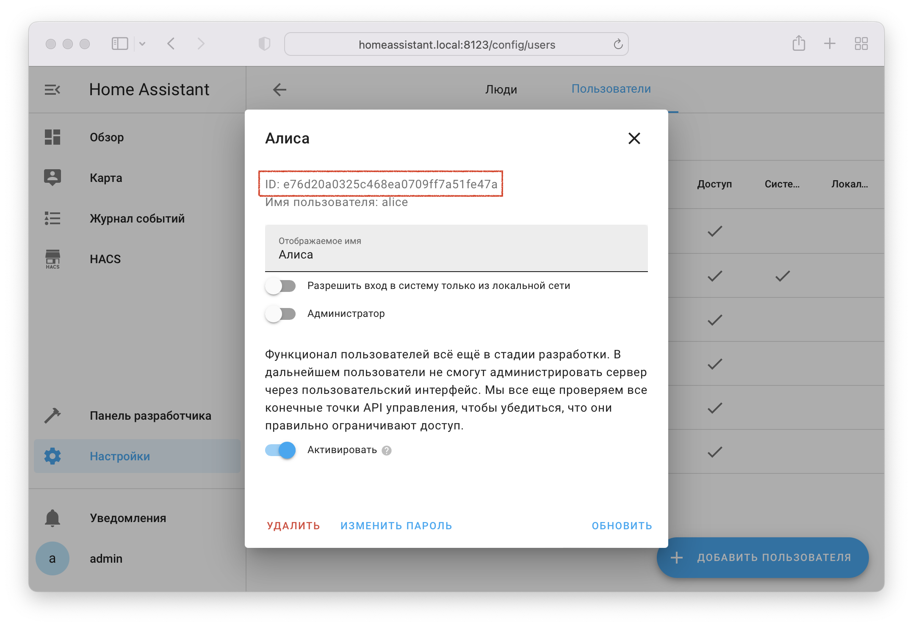

!!! danger "Только для продвинутых пользователей!"

Для использования прямого подключения вы самостоятельно создаёте приватный навык в Яндекс.Диалогах, 
который будет напрямую подключаться к вашему Home Assistant (не используя навык Yaha Cloud).

## Предварительные требования { id=requirements }
* Доступность Home Assistant из интернета по **доменному имени** используя белый IP адрес или
  сторонние сервисы: [Dataplicity](https://github.com/AlexxIT/Dataplicity), [KeenDNS](https://keenetic.link).
* Настроенный HTTPS сертификат. При наличии белого IP адреса можно воспользоваться официальным аддоном Let's Encrypt.
  При использовании Dataplicity или KeenDNS HTTPS настраивается автоматически. Самоподписанные сертификаты работать не будут.
* Добавленная интеграция Yandex Smart Home в режиме прямого подключения.

## Настройка { id=config }
* Установите [компонент](../install/component.md) и добавьте [интеграцию](../install/integration.md) используя прямой тип подключения
* [Проверьте доступность HA из интернета и корректность настройки компонента](#no-connection)
* Зайдите на [dialogs.yandex.ru](https://dialogs.yandex.ru/developer) и создайте диалог (навык) с типом "Умный дом".
  Желательно это делать из под аккаунта, который планируется использовать для управления умным домом.
  При необходимости доступ к навыку можно предоставить другим пользователям Яндекса (вкладка Доступ).

    { width=750 }

* Заполните параметры (вкладка `Настройки`):
 
| Поле              | Значение                                                                                                                             |
|-------------------|--------------------------------------------------------------------------------------------------------------------------------------|
| Название          | Любое (например `Home Assistant`)                                                                                                    |
| Backend           | Endpoint URL: `https://[YOUR_HA_DOMAIN:PORT]/api/yandex_smart_home`<br>(пример: `https://XXXX.dataplicity.io/api/yandex_smart_home`) |
| Тип доступа       | Приватный                                                                                                                            |
| Подзаголовок      | Любой                                                                                                                                |
| Имя разработчика  | Любое                                                                                                                                |
| Официальный навык | Нет                                                                                                                                  |
| Описание          | Любое                                                                                                                                |
| Иконка            | Любая (например [эта](https://community-assets.home-assistant.io/original/3X/6/a/6a99ebb8d0b585a00b407123ff76964cb3e18780.png))      |


* Заполните параметры (вкладка `Связка аккаунтов`):
  
| Поле                      | Значение                                       |
|---------------------------|------------------------------------------------|
| Идентификатор приложения  | `https://social.yandex.net/`                   |
| Секрет приложения         | Любой, например: `secret`                      |
| URL авторизации           | `https://[YOUR_HA_DOMAIN:PORT]/auth/authorize` |
| URL для получения токена  | `https://[YOUR_HA_DOMAIN:PORT]/auth/token`     |
| URL для обновления токена | `https://[YOUR_HA_DOMAIN:PORT]/auth/token`     |

* На вкладке `Настройки` **обязательно нажмите** `Опубликовать` (для приватных навыков публикация автоматическая и моментальная). 
В этот момент УДЯ попробует подключиться к вашему Home Assistant, и если у него не получится - появятся [ошибки валидации](#validation-errors).

!!! fail "Не используйте навык в режиме "Черновик", это может вызывать различные проблемы (дубли уcтройств, ошибки в нотификаторе)"
  
* Откройте [квазар](https://yandex.ru/quasar/iot) или приложение [Дом с Алисой](https://mobile.yandex.ru/apps/smarthome)
* Нажмите иконку :fontawesome-solid-plus: в правом верхнем углу --> `Устройство умного дома`
* Найдите в списке и выберите производителя (ищите по названию диалога, который создали ранее)
* Нажмите кнопку `Привязать к Яндексу`, откроется страница авторизации Home Assistant. Рекомендуется создать отдельного пользователя
  специально для УДЯ и авторизоваться под ним. В этом случае в журнале событий будет видно, когда устройством управлял Яндекс.
* Настройте отправку [уведомлений об изменении состояний устройств](#notifier)

## Уведомления об изменении состояний устройств { id=notifier }
Для уведомления УДЯ об актуальном состоянии устройств и датчиков необходимо выполнить настройку службы `notifier` (нотификатор).

Если этого не сделать, вас ждёт ряд проблем:

1. УДЯ будет узнавать актуальное состояние только при входе в устройство или обновлении страницы
2. Для датчиков не будет отображаться история изменений и графики, бинарные датчики работать не будут
3. Устройства будет невозможно использовать в сценариях УДЯ в качестве условий
4. Непредсказуемое поведение команд вида "Алиса, вентилятор" (без указания что именно нужно сделать)

Для настройки понадобятся:

* `oauth_token`: Получить по [этой ссылке](https://oauth.yandex.ru/authorize?response_type=token&client_id=c473ca268cd749d3a8371351a8f2bcbd) с аккаунта владельца навыка
* `skill_id`: `Идентификатор диалога` на вкладке `Общие сведения` в [консоли](https://dialogs.yandex.ru/developer/skills) Яндекс.Диалогов
* `user_id`: ID пользователя в Home Assistant под которым выполнялась авторизация при связке аккаунтов,
  посмотреть в `Настройки` --> `Люди` --> `Пользователи` --> (выбрать пользователя) --> `ID` (для видимости раздела включите `Расширенный режим` в профиле пользователя):
  
{ width=750 }

* Добавьте в [YAML конфигурацию](../config/getting-started.md#yaml):
    
    !!! example "configration.yaml"
        ```yaml
        yandex_smart_home:
          notifier:
            # xxx замените реальными значениями
            - oauth_token: XXXXXXXXXXXXXXXXXXXXXXXXXXX
              skill_id: xxxxxxxx-xxxx-xxxx-xxxxxxxxxxxx
              user_id: xxxxxxxxxxxxxxxxxxxxxxxxxxxx
    
            # Если в диалоге авторизовано несколько пользователей Home Assistant или
            # к одному Home Assistant подключено несколько навыков - на каждое сочетание
            # диалог/пользователь_HA нужно добавить отдельные записи:
            - oauth_token: XXXXXXXXXXXXXXXXXXXXXXXXXXX  # запрашивается с аккаунта владельца диалога, в котором авторизован user_id
              skill_id: xxxxxxxx-xxxx-xxxx-xxxxxxxxxxxx
              user_id: yyyyyyyyyyyyyyyyyyyyyyyyyyyy
        ```
  
* Перезагрузите YAML конфигурацию
* Выполните [Обновление списка устройств](../quasar.md#discovery)

## Проблемы { id=issues }
### Яндекс не может достучаться до Home Assistant { id=no-connection }
1. Проверьте доступность Home Assistant из интернета через сервис [httpstatus.io](https://httpstatus.io):
   
     * Вставьте ссылку `https://YOUR_HA_DOMAIN:PORT/api/yandex_smart_home/v1.0/ping` и нажмите `Check status`. По этой ссылке должно возвращаться `OK: количество_устройств_отдаваемых_в_УДЯ`
     * Убедитесь, что возвращается код `200` (столбец `Status codes`)
     * Если возвращается `404`:
       
         1. Компонент Yandex Smart Home [не установлен](../install/component.md) 
         2. Интеграция Yandex Smart Home [не добавлена](../install/integration.md) 
         3. В [настройках](../config/getting-started.md) интеграции выбрано облачное подключение
   
     * Если возвращаются другие ошибки - нажмите на стрелку слева от ссылки, чтобы узнать подробнее. Пример ошибки некорректной настройки SSL сертификата:

       

2. Если сертификат настраивался вручную: убедитесь, что используется fullchain сертификат
   (в случае штатного аддона Let's Encrypt он в файле fullchain.cer):
  ```yaml
  http:
    ssl_certificate: /config/acme.sh/YOUR_HA_DOMAIN/fullchain.cer
    ssl_key: /config/acme.sh/YOUR_HA_DOMAIN/YOUR_HA_DOMAIN.key
  ```
3. Если DNS запись добавлялась вручную: убедитесь, что у используемого домена нет AAAA записи (должна быть только A).

### Появляются дубли устройств { id=dups }
Скорее всего часть устройств были добавлены в `Черновик` навыка. 
Удалите их оттуда вручную через [dialogs.yandex.ru/developer](https://dialogs.yandex.ru/developer) (вкладка `Тестирование`).

### Ошибки при публикации навыка { id=validation-errors }
При публикации навыка кнопкой `Опубликовать` могут появляться ошибки валидации. 
Подробнее об ошибке можно узнать, нажав на стрелочку вниз в правом верхнем углу ошибки.


#### Превышено время ожидания ответа { id=timeout }
Если Home Assistant [доступен из интернета](#no-connection), но публикация навыка даёт ошибку `Превышено время ожидания ответа`, 
скорее всего проблема в неработающем (или частично работающем) DNSе внутри контейнера Home Assistant.

Такое иногда встречается на NAS (например QNAP). Для исправления:

* Зайдите внутрь контейнера Home Assistant: `docker exec -it homeassistant sh`
* Укажите DNS сервер Яндекса: `echo nameserver 77.88.8.8 > /etc/resolv.conf`

Исправление актуально только для публикации навыка и не требуется для обычной работы УДЯ.

Другая причина возникновения проблемы - использование [Яндекс.DNS с фильтрацией](https://help.keenetic.com/hc/ru/articles/360000563939-Интернет-фильтр-Яндекс-DNS). 
Попробуйте отключить фильтрацию, если вы её используете.

#### URL не найден { id=not-found }
Возможные причины:

1. Некорректно задан `Endpoint URL` в [настройках навыка](#config)
2. Компонент Yandex Smart Home [не установлен](../install/component.md) 
2. Интеграция Yandex Smart Home [не добавлена](../install/integration.md) 
3. В [настройках](../config/getting-started.md) интеграции выбрано облачное подключение

#### Внутренная ошибка навыка
Обычно возникает из-за проблем в разрешении IP-адреса из имени. 
По состоянию на конец октября 2021 замечено, что без видимой причины могут не работать домены `*.tplinkdns.com` (попробуйте использовать другой динамический DNS).
