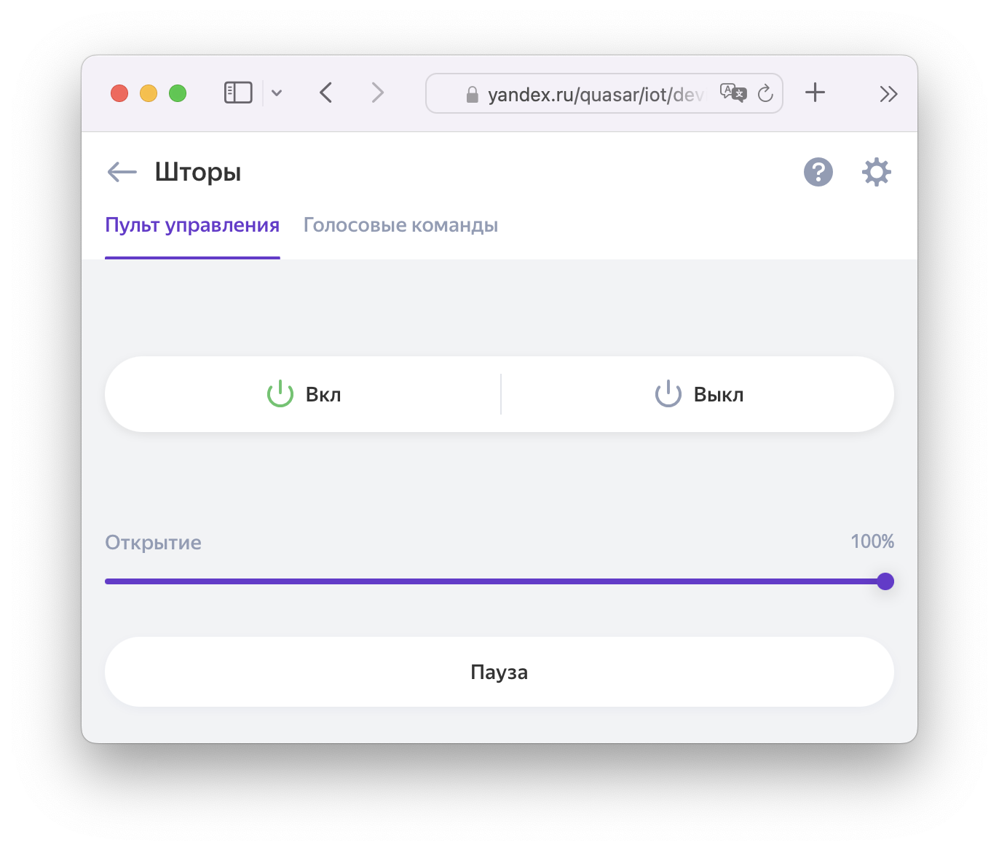

Настраиваются через раздел `entity_config` в [YAML конфигурации](./getting-started.md#yaml), все параметры являются необязательными.

!!! attention "Обратите внимание"
    Наличие объекта в `entity_config` не означает, что он будет передан в УДЯ автоматически. Не забудьте явно разрешить [передачу объекта в УДЯ](./filter.md).

## Имя и комната { id=name-room }

> Параметры: `name` и `room`

Название и комната устройства, имеются [ограничения](../quirks.md#naming) по длине и возможным символам. Можно так же задавать [через интерфейс](../quirks.md#naming).

!!! info "Смотрите также: [как интеграция определяет имя устройства и комнату](../quirks.md#naming)"

!!! example "Пример"
    ```yaml
    yandex_smart_home:
      entity_config:
        switch.dishwasher:
          name: Посудомойка
          room: Кухня
    ```

## Тип устройства { id=type }

> Параметр: `type` ([**возможные значения**](https://yandex.ru/dev/dialogs/smart-home/doc/concepts/device-types.html))

Переопределяет автоматически вычисленный тип устройства. Влияет только на визуальную составляющую в "Дом с Алисой" (и глаголы управления). Никак не влияет на функции устройства.

Например, домен `switch` по умолчанию передаётся как "выключатель" (`switch`) и реагирует на команду "Алиса, включи ХХХ".
Если задать `openable`, то у такого устройства изменится иконка на дверь и фраза на "Алиса, **открой** XXX".

Поддерживается как полное, так и краткое наименование: вместо `devices.types.dishwasher` можно использовать `dishwasher`, или вместо `devices.types.thermostat.ac` можно использовать `thermostat.ac`.

!!! attention "Обратите внимание (УДЯ)"
    После изменения типа **обязательно** удалите устройство вручную в УДЯ и выполните [Обновление списка устройств](../platforms/yandex.md#discovery).

!!! example "Пример"
    ```yaml
    yandex_smart_home:
      entity_config:
        switch.dishwasher:
          name: Посудомойка
          type: dishwasher
        switch.gate:
          name: Ворота
          type: openable
    ```

Рекомендуемые альтернативные типы:

* `switch` для светильников: Предотвращает включение по команде "Алиса, включи свет"
* `thermostat.ac`: Кондиционер
* `cooking.kettle`: Чайник

## Сервис включения/выключения { id=turn_on-off }

> Параметр: `turn_on` и `turn_off`

Переопределяет сервис, который будет вызван при включении или отключении устройства через УДЯ.

Параметр может быть использован, например, для [выбора режима включения](../devices/climate.md) кондиционера.

!!! example "Переопределение сервиса включения/выключения телевизора"
    ```yaml
    yandex_smart_home:
      entity_config:
        media_player.tv:
          turn_on:
            service: script.tv_on
          turn_off:
            service: switch.turn_off
            entity_id: switch.tv_outlet
    ```

Для запрета включения или отключения устройства установите `turn_on` или `turn_off` равным `false` (без кавычек).
Альтернативный способ повлиять на управление устройством - [коды ошибок](../advanced/error-codes.md).

!!! example "Запрет открытия замка из УДЯ (закрывать по-прежнему можно)"
    ```yaml
      yandex_smart_home:
        entity_config:
          lock.front_door:
            turn_on: false
    ```

## Поддерживаемые функции (media_player) { id=features }

> Параметр: `features` (только для `media_player`)

> Возможные значения: `volume_mute`, `volume_set`, `next_previous_track`, `select_source`[^1], `turn_on_off`[^1], `play_pause`[^1], `play_media`[^1] (список, можно все сразу)

Используется для явного указания поддерживаемых устройством функций.
Необходим для устройств, которые меняют набор функций в зависимости от своего состояния (например Chrome Cast или Universal Mediaplayer).

!!! example "Пример"
    ```yaml
    yandex_smart_home:
      entity_config:
        media_player.chrome_cast:
          features:
            - volume_mute
            - volume_set
            - next_previous_track
            - select_source
            - turn_on_off
            - play_pause
            - play_media
    ```

[^1]: Начиная с версии 0.6.1

## Выбор каналов (media_player) { id=support_set_channel }

> Параметр: `support_set_channel` (только для `media_player`)

> Возможные значения: `false`

Отключает функцию выбора канала для `media_player` через цифровую панель и сервис `media_player.play_media`.

Может потребоваться для устройств, которые не поддерживают выбор канала, но поддерживают сервис `play_media` и переключение треков.

!!! example "Пример"
    ```yaml
    yandex_smart_home:
      entity_config:
        media_player.music_player:
          support_set_channel: false
    ```

## Раздельные кнопки вкл/выкл { id=state_unknown }

> Параметр: `state_unknown`

> Возможные значения: `true`

Включает раздельное отображение кнопок для включение и отключения устройства.

Рекомендуется использовать для устройств, которые не возвращают своё актуальное состояние (например шторы или вентилятор, управляемые по IR каналу).



!!! example "Пример"
    ```yaml
    yandex_smart_home:
      entity_config:
        cover.ir_shades:
          state_unknown: true
    ```

В версии 0.6.0 поддерживаются только домены `cover` и `media_player`.

## Ограничение уровня громкости { id=range }

> Параметр: `range`

Ограничивает диапазон, в котором может регулироваться громкость устройства.

!!! example "Пример"
    ```yaml
    yandex_smart_home:
      entity_config:
        media_player.receiver:
          range:
            max: 95
            min: 20
            precision: 2  # шаг регулировки
    ```
