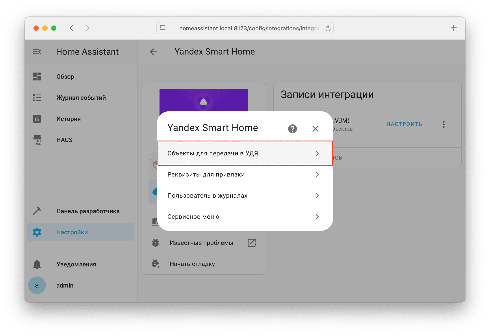
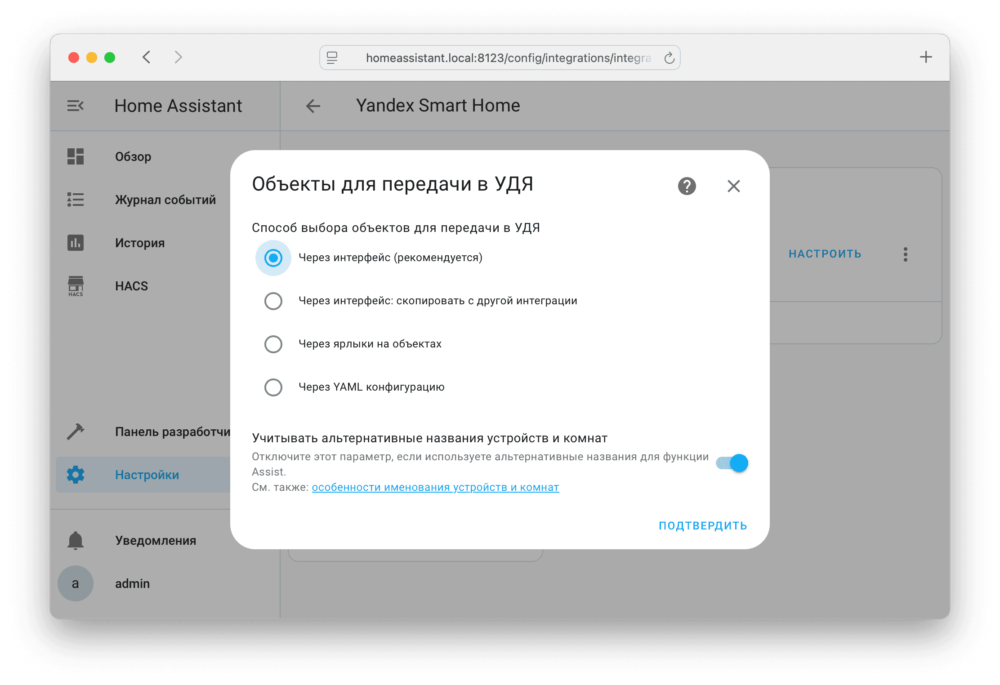

По умолчанию в УДЯ не передаются никакие объекты.

Выбрать объекты, которые будут переданы в УДЯ в виде устройств можно несколькими способами (в зависимости от ваших предпочтений): в настройках интеграции, ярлыки на объектах, или YAML конфигурацию.

!!! danger "Внимание!"
    Удаление устройств из УДЯ возможно **только** вручную. Удаляйте устройство из УДЯ только после исключения объекта из списка для передачи.
    Для удаления всех устройств - [отвяжите навык (производителя)](../platforms/yandex.md#unlink).

    Маруся всегда отображает только те устройства, которые выбраны в списке для передачи.

!!! warning "Недопустимо оставлять в УДЯ устройства, у которых объект не выбран для передачи. Такие устройства будут работать некорректно."

## В настройках интеграции { id=config-flow }

Выбрать объекты для передачи можно в [настройках интеграции](../config/getting-started.md#gui) --> Объекты для передачи в УДЯ --> Через интерфейс:

{ width=750 }
{ width=750 }

## Через ярлыки на объектах { id=label }

Выбирать объекты в настройках интеграции может быть не всегда удобным, поэтому есть альтернативный вариант - ярлыки на объектах. Для его использования:

* Создайте ярлык в разделе `Настройки` --> [`Пространства, зоны и ярлыки`](https://my.home-assistant.io/redirect/areas/) --> Ярлыки
* Назначьте ярлык на объекты, которые вы хотите передать в УДЯ.
* Используйте способ выбора объектов для передачи в УДЯ `Через ярлыки на объектах` в настройке существующей интеграции или при создании новой.

!!! hint "После добавления ярлыка к новым объектам перезагрузите интеграцию на странице `Настройки` --> `Устройства и службы` --> `Интеграции` --> `Yandex Smart Home` или [Обновите список устройств](../platforms/yandex.md#discovery) вручную"

{ width=750 }
{ width=750 }

## Через YAML конфигурацию { id=yaml }

Объекты выбираются в разделе `filter`, поддерживаемые фильтры:

* `include_domains`
* `include_entities`
* `include_entity_globs`
* `exclude_domains`
* `exclude_entities`
* `exclude_entity_globs`

Приоритизация по фильтрам работает аналогично интеграции [Recorder](https://www.home-assistant.io/integrations/recorder/#configure-filter).

!!! warning "Выбор объектов через YAML конфигурацию должен быть явно включен в [настройках интеграции](../config/getting-started.md#gui) --> Объекты для передачи в УДЯ."

!!! example "Пример"
    ```yaml
    yandex_smart_home:
      filter:
        include_domains:
          - switch
          - light
        include_entities:
          - media_player.tv
          - media_player.tv_lg
          - media_player.receiver
        include_entity_globs:
          - sensor.temperature_*
        exclude_entities:
          - light.highlight
        exclude_entity_globs:
          - sensor.weather_*
    ```

!!! example "Пример: передача всех объектов, **не рекомендуется**!"
    ```yaml
    yandex_smart_home:
      filter:
        include_entity_globs: "*"
    ```

## Миграция с YAML конфигурации { id=migration-from-yaml }

Если вы выбираете объекты для передачи через YAML конфигурацию и хотите перейти на другой способ выбора - это можно сделать средствами интеграции, а не переносить объекты вручную.

Для этого:

1. В [настройках интеграции](./getting-started.md#gui) измените способ выбора объектов для передачи на новый способ: `Через интерфейс` или `Через ярлыки на объектах`. При способе `Через интерфейс` выберите один любой, который уже передаётся в УДЯ.
2. В настройках интеграции откройте `Сервисное меню` и отметьте `Перенести фильтр объектов из YAML` --> `Подтвердить`

!!! warning "В переносе будут задействованы только объекты, которые попадают под фильтр и **существуют** в Home Assistant на момент выполнения действия."

Поведение для разных способов выбора объектов:

* Через интерфейс: объекты, попавшие под фильтр, будут **добавлены** к объектам, которые уже выбраны через интерфейс.
* Через ярлык на объектах: к объектам, попавшим под фильтр, будет **добавлена** та метка, по которой отбираются объекты для передачи в УДЯ.
