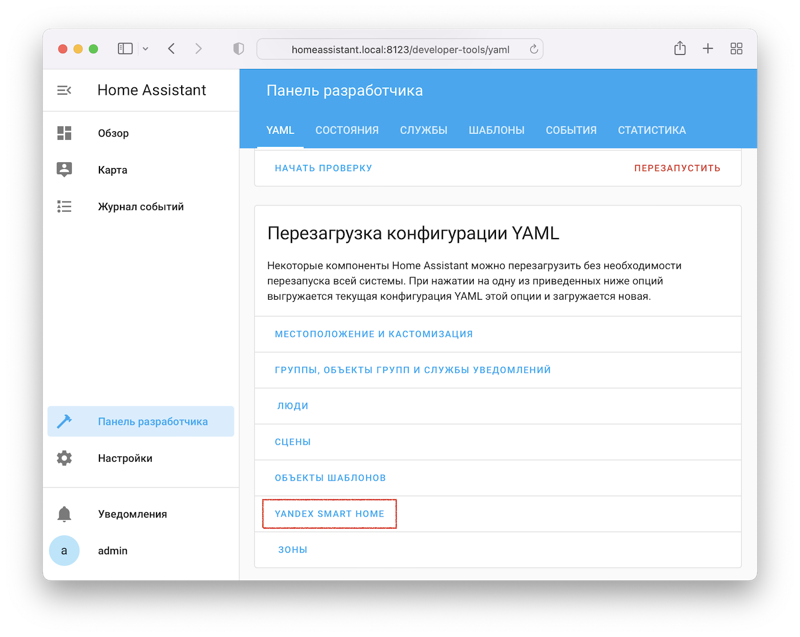

Интеграция настраивается двумя способами: YAML конфигурация и интерфейс Home Assistant.
Оба способа могут быть задействованы **одновременно**.

## Через интерфейс Home Assistant { id=gui }

На странице `Настройки` --> `Устройства и службы` --> [`Интеграции`](https://my.home-assistant.io/redirect/integrations/) найдите
интеграцию Yandex Smart Home и нажмите кнопку `Настроить`:

{ width=750 }
{ width=750 }

## Через YAML конфигурацию { id=yaml }

Часть параметров может быть настроена только через YAML конфигурацию в файле [`configuration.yaml`](https://www.home-assistant.io/docs/configuration/).
Его можно отредактировать, например, через аддон [File Editor](https://my.home-assistant.io/redirect/supervisor_addon/?addon=core_configurator).

!!! example "Пример configuration.yaml"
    ```yaml
    default_config:
    yandex_smart_home:
      entity_config:
        light.room_main:
          name: Люстра
          room: Комната
    ```

!!! example "[Пример](https://github.com/dext0r/yandex_smart_home/blob/master/tests/fixtures/valid-config.yaml) большого configuration.yaml"

После изменений в `configuration.yaml` перезагрузите YAML конфигурацию Yandex Smart Home через `Панель разработчика` --> `YAML` --> `Перезагрузка конфигурации YAML`:

{ width=750 }
