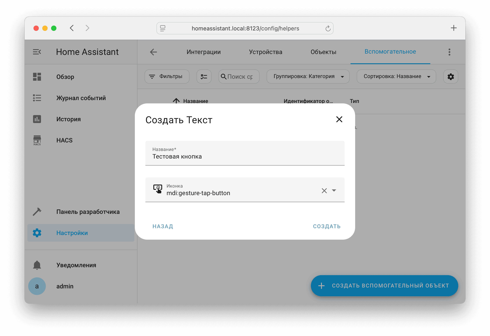
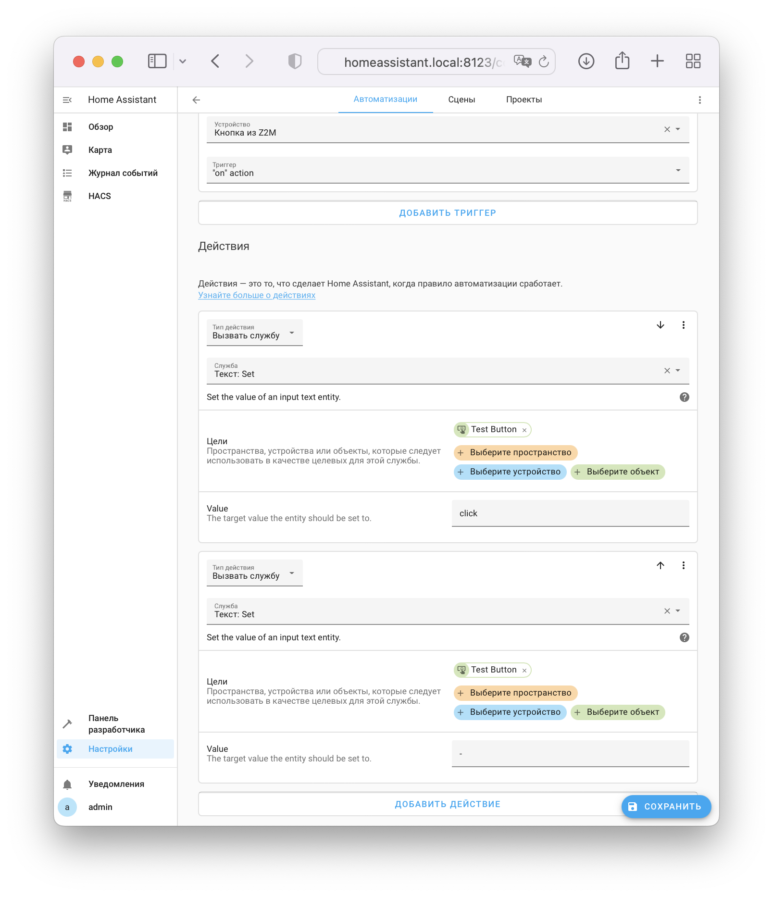

## Простая настройка { id=easy }

Достаточно просто можно настроить кнопки, у которых имеется объект, в состоянии которого появляется текст (событие) при нажатии на кнопку.

Поддерживаемые события: `single`, `click`, `double`, `double_click`, `long`, `long_click`, `long_click_press`, `hold`

Такие кнопки обычно создают интеграции:

* AlexxIT/Xiaomi Gateway 3
* Zigbee2MQTT с включенным `legacy` режимом
* Zigbee2MQTT с включенной настройкой `experimental_event_entities`

{ width=750 }

Для подключения подобных кнопок:

* [Узнайте](../faq.md#get-entity-id) ID объекта, в котором появляется текст при нажатии на кнопку (в примере используется `sensor.button_action`)
* Добавьте объект в список объектов для передачи и обновите список устройств в УДЯ
* Если кнопка не появилась в УДЯ - добавьте в [YAML конфигурацию](../config/getting-started.md#yaml):

    !!! example "configuration.yaml"
        ```yaml
        yandex_smart_home:
          entity_config:
            sensor.button_action:
              device_class: button
        ```

## Сложная настройка { id=advanced }

Позволяет сделать "виртуальную" кнопку из любого события в Home Assistant.

В качестве примера будем использовать переключатель IKEA Tradfri, подключенный через Zigbee2MQTT (с отключенным `Home Assistant legacy triggers`).

Как можно заметить, в этой кнопке нет никаких объектов, только уровень заряда:

{ width=750 }

### Шаг 1 { id=advanced-step-1 }

На странице `Настройки` --> `Устройства и службы` --> [`Вспомогательное`](https://my.home-assistant.io/redirect/helpers/) создайте вспомогательный объект типа Текст с любым названием.

Из этого вспомогательного элемента будет создана кнопка в УДЯ.

{ width=750 }

!!! example "Альтернативный способ"
    ```yaml
    input_text:
      test_button:
        name: Тестовая кнопка
        initial: ''
    ```

### Шаг 2 { id=advanced-step-2 }

На странице устройства-кнопки нажмите :fontawesome-solid-plus: в блоке `Автоматизации` --> Использовать устройство в качестве триггера. Откроется страница создания автоматизации, которая при нажатии на реальную кнопку будет записывать действие в виртуальную кнопку. В выпадающем списке `Триггер` выберите действие, которое будет считаться нажатием на нашу виртуальную кнопку.

{ width=750 }

!!! hint "Если в выпадающем списке нет некоторых возможностей кнопки - выполните эти действие с кнопкой, так Home Assistant сможет о них узнать"

### Шаг 3 (интерфейс) { id=advanced-step-3-gui }

Добавьте два действия:

1. Тип действия: `Выполнить действие`

    Действие: `input_text.set_value`

    Цели: Вспомогательный элемент из Шага 1

    Значение: событие в УДЯ, на выбор: `click` (одиночное нажатие), `double_click` - двойное нажатие, `long_press` - долгое нажатие

2. Тип действия: `Вызвать действие`

    Действие: `input_text.set_value`

    Цели: Вспомогательный элемент из Шага 1

    Значение: `-`

{ width=750 }

Сохраните автоматизацию и переходите к [Шагу 4](#advanced-step-4).

!!! tip "На одну виртуальную кнопку можно создать три автоматизации (на одиночное, двойное и долгое нажатие)"

### Шаг 3 (YAML) { id=advanced-step-3-yaml }

На странице создания автоматизации в блоке когда нажмите :fontawesome-solid-ellipsis-vertical: и выберите `Текстовый редактор`.

Скопируйте появившийся текст, он будет использоваться в качестве триггера в автоматизации.

{ width=750 }

Для заполнения `input_text` при нажатии на кнопку создайте автоматизацию:

!!! example "configuration.yaml"
    ```yaml
    automation:
      - alias: test_button_click
        trigger:
          - domain: mqtt
            device_id: 1438be8941b2ea53be93ce2d476e68fc
            type: action
            subtype: "on"
            metadata: {}
            trigger: device
        action:
          - action: input_text.set_value
            entity_id: input_text.test_button # ID объекта виртуальной кнопки
            data:
              value: click # поддерживаются click, double_click, long_press

          - action: input_text.set_value
            entity_id: input_text.test_button
            data:
              value: ''
    ```

!!! tip "На одну виртуальную кнопку можно создать три автоматизации (на одиночное, двойное и долгое нажатие)"

### Шаг 4 { id=advanced-step-4 }

* Добавьте в [YAML конфигурацию](../config/getting-started.md#yaml):

    !!! example "configuration.yaml"
        ```yaml
        yandex_smart_home:
          entity_config:
            input_text.test_button:
              device_class: button
        ```

* Выберите виртуальную кнопку `input_text.test_button`, созданную на первом шаге, в списке [объектов для передачи в УДЯ](../config/filter.md)
