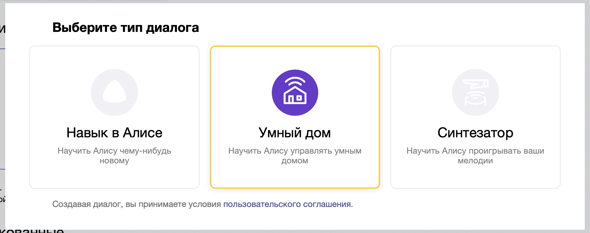
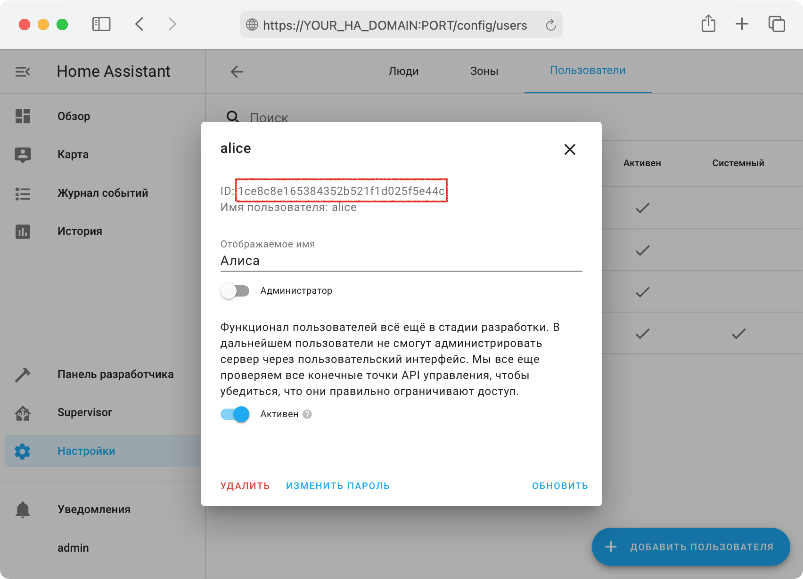

# Прямое подключение
**Только для продвинутых пользователей!**
Для использования прямого подключения вы самостоятельно создаёте приватный навык в Яндекс.Диалогах, который будет напрямую подключаться к вашему Home Assistant минуя облако.

- [Предварительные требования](#предварительные-требования)
- [Настройка](#настройка)
- [Уведомления об изменении состояний устройств](#уведомления-об-изменении-состояний-устройств)
  - [Настройка](#настройка-1)
- [Проблемы](#проблемы)
  - [Яндекс не может достучаться до Home Assistant](#яндекс-не-может-достучаться-до-home-assistant)
  - [Появляются дубли устройств](#появляются-дубли-устройств)
  - [Ошибки при публикации навыка](#ошибки-при-публикации-навыка)
    - [Превышено время ожидания ответа](#превышено-время-ожидания-ответа)
    - [URL не найден](#url-не-найден)
    - [Внутренная ошибка навыка](#внутренная-ошибка-навыка)
    - [Ошибка "Failed to send state notification: UNKNOWN_USER"](#ошибка-failed-to-send-state-notification-unknown_user)
- [Отладка](#отладка)
  - [Получение лога обновления списка устройств (из УДЯ)](#получение-лога-обновления-списка-устройств-из-удя)
  - [Получение лога обновления списка устройств (из Home Assistant)](#получение-лога-обновления-списка-устройств-из-home-assistant)

## Предварительные требования
* Доступность Home Assistant из интернета по **доменному имени** используя белый IP адрес или
  сторонние сервисы: [Dataplicity](https://github.com/AlexxIT/Dataplicity), [KeenDNS](https://keenetic.link).
* Настроенный HTTPS сертификат. При наличии белого IP адреса можно воспользоваться официальным аддоном Let's Encrypt.
  При использовании Dataplicity или KeenDNS HTTPS настраивается автоматически. Самоподписанные сертификаты работать не будут.
* Настроенный компонент Yandex Smart Home в режиме прямого (direct) подключения.

## Настройка
* Ознакомьтесь с разделом [подготовка к настройке](../README.md#подготовка-к-настройке) и выполните [настройку интеграции](../README.md#настройка-интеграции).
* [Проверьте доступность HA из интернета и корректность настройки компонента](#яндекс-не-может-достучаться-до-home-assistant)
* Зайдите на [dialogs.yandex.ru](https://dialogs.yandex.ru) и создайте диалог (навык) с типом "Умный дом".
  Желательно это делать из под аккаунта, который планируется использовать для управления умным домом.
  При необходимости доступ к диалогу можно предоставить другим пользователям Яндекса (вкладка Доступ).

  

* Заполните параметры:
  * Вкладка "Настройки":
    | Поле              | Значение     |
    | ----------------- | ------------ |
    | Название          | Любое        |
    | Backend           | Endpoint URL: `https://[YOUR_HA_DOMAIN:PORT]/api/yandex_smart_home` (пример: `https://XXXX.dataplicity.io/api/yandex_smart_home`) |
    | Тип доступа       | Приватный    |
    | Подзаголовок      | Любой        |
    | Имя разработчика  | Любое        |
    | Официальный навык | Нет          |
    | Описание          | Любое        |
    | Иконка            | Любая (например [эта](https://community-assets.home-assistant.io/original/3X/6/a/6a99ebb8d0b585a00b407123ff76964cb3e18780.png)) |


  * Вкладка "Связка аккаунтов":
    | Поле                        | Значение                                          |
    | --------------------------- | ------------------------------------------------- |
    | Идентификатор приложения    | https://social.yandex.net/                        |
    | Секрет приложения           | Любой, например: `secret`                         |
    | URL авторизации             | `https://[YOUR_HA_DOMAIN:PORT]/auth/authorize`    |
    | URL для получения токена    | `https://[YOUR_HA_DOMAIN:PORT]/auth/token`        |
    | URL для обновления токена   | `https://[YOUR_HA_DOMAIN:PORT]/auth/token`        |

* На вкладке "Настройки" **обязательно нажмите** "Опубликовать" (для приватных навыков публикация автоматическая и моментальная). **Не используйте навык в режиме "Черновик"**, это может вызывать различные проблемы (дубли уcтройств, ошибки в нотификаторе).
  В этот момент УДЯ попробует подключиться к вашему Home Assistant, и если у него не получится - появятся [ошибки валидации](#ошибки-при-публикации-навыка).
* Откройте [квазар](https://yandex.ru/quasar/iot) или раздел "Устройства" в мобильном приложении Яндекс.
* Нажмите кнопку "+" в правом верхнем углу, выберите "Устройство умного дома".
* Найдите в списке и выберите производителя (ищите по названию диалога, который создали ранее).
* Нажмите кнопку "Привязать к Яндексу", откроется страница авторизации Home Assistant. Рекомендуется создать отдельного пользователя
  специально для УДЯ и авторизоваться под ним. В этом случае в журнале событий будет видно, когда устройством управлял Яндекс.
* Настоятельно рекомендуется настроить [уведомления об изменении состояний](#уведомления-об-изменении-состояний-устройств).

## Уведомления об изменении состояний устройств
Для уведомления УДЯ об актуальном состоянии устройств и датчиков **настоятельно** рекомендуется выполнить настройку службы `notifier`.
Если этого не сделать, УДЯ будет узнавать актуальное состояние только при входе в устройство или обновлении страницы.
Так же однозначно будут проблемы при использовании команд вида "Алиса, вентилятор" (без указания что именно нужно сделать),
так как состояние устройства меняется не только через УДЯ, но и в Home Assistant напрямую.

Кроме передачи состояний `notifier` инициирует обновление списка устройств в УДЯ при перезапуске Home Assistant или перезагрузке конфигурации.
Благодаря этому можно не нажимать "Обновить список устройств" при появлении нового устройства или изменении списка устройств для передачи в УДЯ,
а достаточно просто перезапустить HA или перезагрузить конфигурацию компонента, обновление произойдёт в течение 10-20 секунд.

Иногда УДЯ не подхватывает изменения автоматически. В этом случае необходимо выполнить обновление списка устройств вручную.

### Настройка
Для настройки понадобятся:
* `oauth_token`: Получить по [этой ссылке](https://oauth.yandex.ru/authorize?response_type=token&client_id=c473ca268cd749d3a8371351a8f2bcbd) с аккаунта владельца диалога.
* `skill_id`: "Идентификатор диалога" на вкладке "Общие сведения" в [консоли](https://dialogs.yandex.ru/developer/skills) Яндекс.Диалоги.
* `user_id`: ID пользователя в Home Assistant под которым выполнялась авторизация при привязке диалога.
  Посмотреть в Настройки > Пользователи > (выбрать пользователя) > ID (для видимости раздела включите "Расширенный режим" в профиле пользователя):

  

Добавить в конфигурацию `yandex_smart_home` (`xxxx` заменить реальными значениями):
```yaml
yandex_smart_home:
  notifier:
    - oauth_token: XXXXXXXXXXXXXXXXXXXXXXXXXXX
      skill_id: xxxxxxxx-xxxx-xxxx-xxxxxxxxxxxx
      user_id: xxxxxxxxxxxxxxxxxxxxxxxxxxxx

    # Если в диалоге авторизовано несколько пользователей Home Assistant или
    # к одному Home Assistant подключено несколько навыков - на каждое сочетание
    # диалог/пользователь_HA нужно добавить отдельные записи:
    - oauth_token: XXXXXXXXXXXXXXXXXXXXXXXXXXX  # запрашивается с аккаунта владельца диалога, в котором авторизован user_id
      skill_id: xxxxxxxx-xxxx-xxxx-xxxxxxxxxxxx
      user_id: yyyyyyyyyyyyyyyyyyyyyyyyyyyy
```

## Проблемы

### Яндекс не может достучаться до Home Assistant
1. Проверьте доступность Home Assistant из интернета через сервис https://httpstatus.io:
  * Вставьте ссылку `https://YOUR_HA_DOMAIN:PORT/api/yandex_smart_home/v1.0/ping` и нажмите `Check status`. По этой ссылке должно возвращаться `OK: количество_устройств_отдаваемых_в_УДЯ`
  * Убедитесь, что возвращается код `200` (столбец `Status codes`)
  * Если возвращается `404` - скорее всего интеграция не установлена или не [настроена](#настройка)
  * Если возвращаются другие ошибки - нажмите на стрелку слева от ссылки, чтобы узнать подробнее. Пример ошибки некорректной настройки SSL сертификата:

      

2. Если сертификат настраивался вручную: убедитесь, что используется fullchain сертификат
  (в случае штатного аддона Let's Encrypt он в файле fullchain.cer):
  ```yaml
  http:
    ssl_certificate: /config/acme.sh/YOUR_HA_DOMAIN/fullchain.cer
    ssl_key: /config/acme.sh/YOUR_HA_DOMAIN/YOUR_HA_DOMAIN.key
  ```
3. Если DNS запись добавлялась вручную, убедитесь, что у используемого домена нет AAAA записи (должна быть только A).

### Появляются дубли устройств
Скорее всего часть устройств были добавлены в "Черновик" навыка. Удалите их оттуда вручную через [dialogs.yandex.ru/developer](https://dialogs.yandex.ru/developer) (вкладка "Тестирование").

### Ошибки при публикации навыка
При публикации навыка кнопкой "Опубликовать" могут появляться ошибки валидации. Подробнее об ошибке можно узнать, нажав на стрелочку вниз в правом верхнем углу ошибки.

#### Превышено время ожидания ответа
Если Home Assistant [доступен из интернета](#яндекс-не-может-достучаться-до-home-assistant), но публикация навыка даёт ошибку "Превышено время ожидания ответа", скорее всего проблема в неработающем (или частично работающем) DNSе внутри контейнера Home Assistant.

Такое иногда встречается на NAS (например QNAP). Для исправления:
* Зайдите внутрь контейнера Home Assistant: `docker exec -it homeassistant sh`
* Укажите DNS сервер Яндекса: `echo nameserver 77.88.8.8 > /etc/resolv.conf`

Исправление актуально только для публикации навыка и не требуется для обычной работы УДЯ.

Другая причина возникновения проблемы - использование [Яндекс.DNS с фильтрацией](https://help.keenetic.com/hc/ru/articles/360000563939-Интернет-фильтр-Яндекс-DNS). Попробуйте отключить фильтрацию, если вы её используете.

#### URL не найден
* Убедитесь, что интеграция включена на странице "Интеграции".
* Попробуйте удалить интеграцию и добавить снова. При настройке обязательно выберите "Прямое подключение".

#### Внутренная ошибка навыка
Обычно возникает из-за проблем в разрешении IP-адреса из имени. По состоянию на конец октября 2021 замечено, что без видимой причины могут не работать домены `*.tplinkdns.com` (попробуйте использовать другой динамический DNS).

#### Ошибка "Failed to send state notification: UNKNOWN_USER"
Попробуйте "Обновить список устройств" в УДЯ, а если это не помогло:
1. [Включите отладку](#получение-лога-обновления-списка-устройств-из-home-assistant)
2. Выполните обновление списка устройств в УДЯ
3. В `home-assistant.log` найдите запрос `/user/devices` и убедитесь, что `user_id` в нём совпадает с `user_id` в конфигурации нотификатора

## Отладка

### Получение лога обновления списка устройств (из УДЯ)
* Зайдите в диалог на [dialogs.yandex.ru/developer](https://dialogs.yandex.ru/developer)
* Вкладка "Тестирование" > выбрать "Опубликованная версия"
* Нажмите кнопку "+" > "Устройство умного дома" > "Обновить список устройств"
* В окне отладки появится:
    ```
    Sending request to provider: GET https://YOUR_HA_DOMAIN/api/yandex_smart_home/v1.0/user/devices
    Got response from provider XXXXX: 200 {"request_id": .... (большой json)
    ```
  Нужно только то, что в строчке Got Response и ниже.
  Пожалуйста, не включайте строку "Sending request", в ней адрес вашего Home Assistant, пусть эта информация лучше остается в тайне :)

### Получение лога обновления списка устройств (из Home Assistant)
* Включите отладку через `configuration.yaml`:
    ```yaml
    logger:
      default: warning
      logs:
        custom_components.yandex_smart_home: debug
    ```
* Перезапустите Home Assistant
* Выполните "Обновление списка устройств" в УДЯ, в логе Home Assistant появятся строчки:
    ```
    [custom_components.yandex_smart_home.http] Request: https://YOUR_HA_DOMAIN/api/yandex_smart_home/v1.0/user/devices
    [custom_components.yandex_smart_home.http] Response: {"request_id": ...
    ```
  Нужно только то, что в строчке Response. Если до этих строк есть ошибки, захватите и их тоже.
