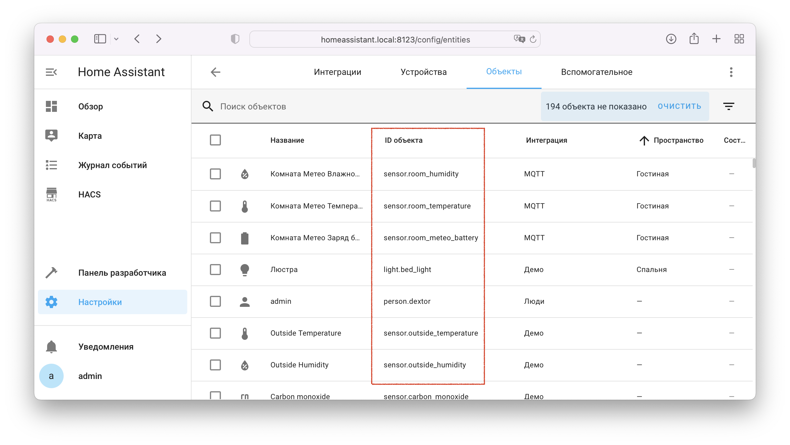

## Где найти одноразовый код или ID и пароль для облачного подключения? { id=cloud-creds }

Откройте [настройки интеграции](./config/getting-started.md#gui) --> `Реквизиты для привязки`

{ width=750 }
{ width=750 }

## Как поменять тип подключения или какой тип подключения лучше? { id=connection-type }

Подробнее в разделе [Тип подключения](./config/connection-type.md)

## Где найти entity_id объекта? { id=get-entity-id }

1. На странице `Настройки` --> `Устройства и службы` --> [`Объекты`](https://my.home-assistant.io/redirect/entities/): 
    { width=750 }
2. При клике на любом объекте на странице устройства: `Настройка` --> `Устройства и службы` --> [`Устройства`](https://my.home-assistant.io/redirect/devices/) --> Выбрать устройство: 
    { width=750 }
    { width=750 }
    { width=750 }

## Как узнать entity_id объекта из устройства в УДЯ { id=get-entity-id-yandex }

В приложении [Дом с Алисой](https://ya.cc/iot_app):
Зайдите в устройство --> Нажмите :fontawesome-solid-gear: в правом верхнем углу --> `Об устройстве` --> `Модель устройства`

{ width=300 }

## Почему навык называется Yaha Cloud, а не Home Assistant? { id=yaha }

При использовании облачного подключения в УДЯ выбирается навык со странным названием Yaha Cloud, а не с логичным Home Assistant.

Почему? Причина проста: "Home Assistant" является зарегистрированной торговой маркой,
а по правилам каталога навыков Алисы торговую марку может использовать только её владелец (в данном случае компания Nabu Casa).

Что значит Yaha? Всё просто - **YA**ndex + **H**ome**A**ssistant :)
