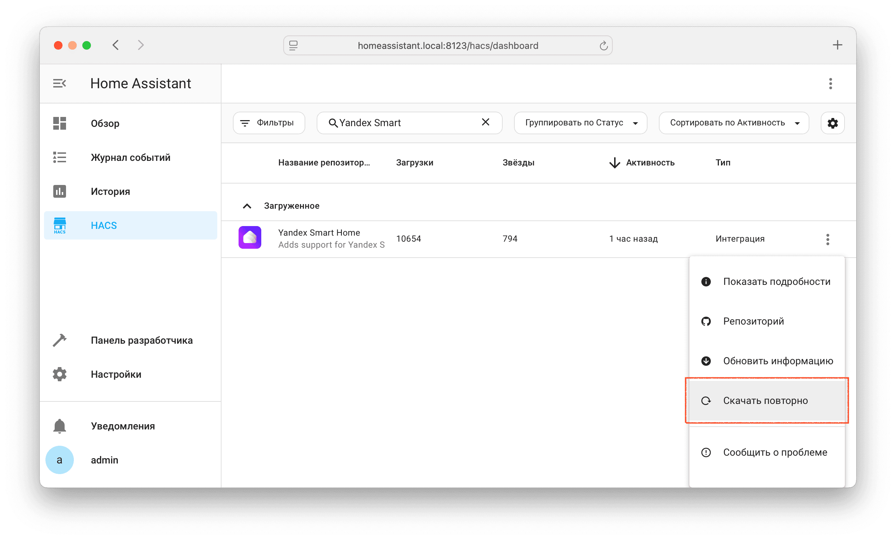

## Установка через HACS { id=hacs }

!!! success "Рекомендованный способ"

* [Установите](https://hacs.xyz/docs/use/download/download/) компонент HACS --> Перезагрузите Home Assistant --> [Добавьте интеграцию](https://hacs.xyz/docs/use/configuration/basic/) HACS
* Откройте HACS через боковую панель
* В поиске введите `Yandex Smart Home`
* Нажмите :fontawesome-solid-ellipsis-vertical: в строчке с интеграцией --> `Скачать`
* Для завершения установки перезагрузите Home Assistant

{ width=750 }
{ width=750 }

## Установка вручную { id=manual }

!!! warning "Не рекомендуется!"

!!! hint "Обновление выполняется аналогично установке"

* Скачайте архив `yandex_smart_home.zip` из [последнего релиза](https://github.com/dext0r/yandex_smart_home/releases/latest)
* Создайте подкаталог `custom_components/yandex_smart_home` в каталоге где расположен файл `configuration.yaml`
* Распакуйте содержимое архива в `custom_components/yandex_smart_home`
* Перезапустите Home Assistant

## Обновление через HACS { id=update }

При выпуска новой версии компонента информация о необходимости обновления появится в разделе Настройки. Если этого не произошло, проверьте обновления вручную через Настройки --> Система --> [Обновления](https://my.home-assistant.io/redirect/updates/) --> :material-refresh:

Если по какой-то причине обновление не появляется, скачайте компонент повторно через HACS:

* Откройте HACS через боковую панель
* В поиске введите `Yandex Smart Home`
* Нажмите :fontawesome-solid-ellipsis-vertical: в строчке с интеграцией --> `Скачать повторно`
* Для завершения обновления перезагрузите Home Assistant

!!! hint "Не беспокойтесь"
    Повторное скачивание компонента **не удаляет** уже настроенную интеграцию.

{ width=750 }
