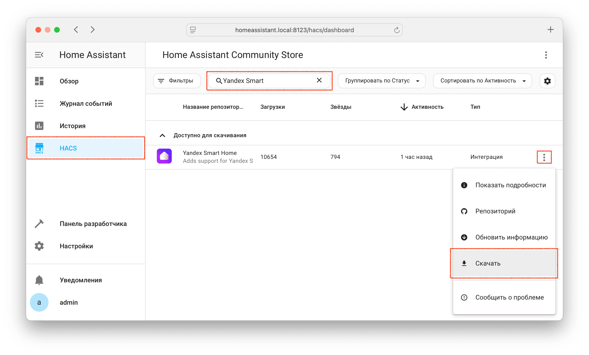

## Через HACS (рекомендованный способ) { id=hacs }
* Установите [HACS](https://hacs.xyz/docs/setup/download)
* Откройте HACS --> Интеграции
* Нажмите кнопку `Исследуйте и устанавливайте репозитории` в правом нижнем углу
* В поиске введите `Yandex` и выберите `Yandex Smart Home`
* Нажмите `Загрузить этот репозиторий с помощью HACS` --> `Скачать`
* Для завершения установки перезагрузите Home Assistant

{ width=750 }
{ width=750 }

## Вручную (не рекомендуется) { id=manual }
* Вручную скопируйте папку `custom_components/yandex_smart_home` из [latest release](https://github.com/dext0r/yandex_smart_home/releases/latest) в директорию `/config/custom_components`
* Перезапустите Home Assistant

## Переход на бета-версию { id=change-version }
Для перехода на бета-версию компонента или установки другой версии:

* Откройте HACS, найдите компонент `Yandex Smart Home` и кликните по нему
* Нажмите три точки в правом верхнем углу
* Нажмите `Обновить информацию`, затем `Скачать повторно`
* Поставьте галочку `Показывать бета-версии` и выберите нужную версию
* Перезапустите Home Assistant

!!! hint "Не беспокойтесь"
    Повторное скачивание компонента **не удаляет** уже настроенную интеграцию

{ width=750 }
{ width=750 }
{ width=750 }
