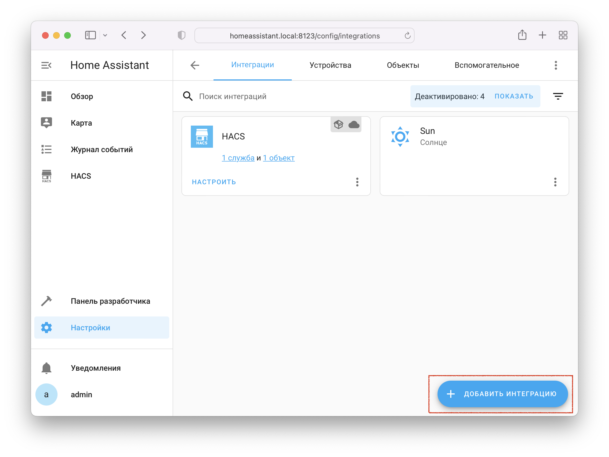

Интеграция поддерживает два типа подключения[^1]:

1. Облачное подключение: лёгкое и быстрое подключение через навык [Yaha Cloud](https://dialogs.yandex.ru/store/skills/cef326b2-home-assistant), рекомендуется для всех пользователей
2. Прямое подключение: требуется доступ к Home Assistant по HTTPS через интернет, сложная [многоступенчатая настройка](../advanced/direct-connection/index.md), только для продвинутых пользователей

Чтобы добавить интеграцию в Home Assistant:

* [Установите](./component.md) компонент Yandex Smart Home (если он не установлен)
* Откройте страницу `Настройки` --> `Устройства и службы` --> [`Интеграции`](https://my.home-assistant.io/redirect/integrations/)
* Нажмите `Добавить интеграцию`, в поиске найдите `Yandex Smart Home` (если интеграции нет в списке - обновите страницу)
* **Внимательно** следуйте указаниям мастера настройки

!!! note "Обратите внимание"
    Компонент позволяет добавить несколько интеграцией с разными типами подключения и набором устройств.

{ width=750 }
{ width=750 }
{ width=750 }

[^1]: [Какой тип подключения лучше?](../config/connection-type.md#compare)
