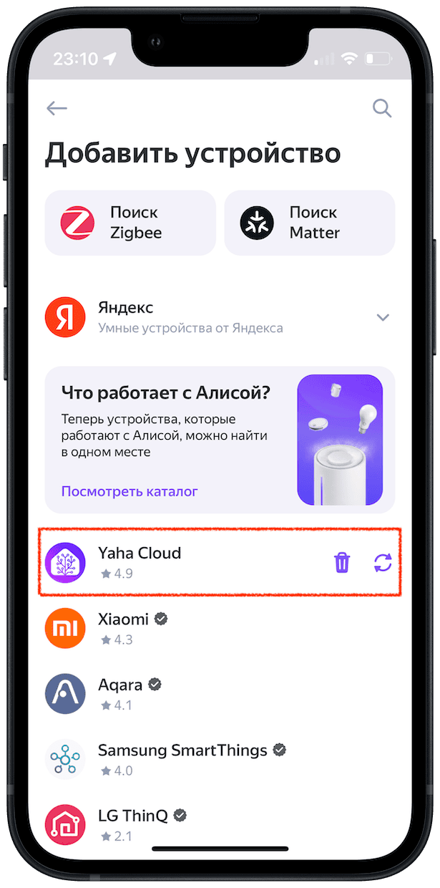

## Обновление списка устройств { id=discovery }

Нажмите :fontawesome-solid-plus: в правом верхнем углу --> `Устройство умного дома` -->
Найдите производителя `Yaha Cloud` (или другой навык) --> :fontawesome-solid-arrows-rotate:

{ width=360 }
{ width=360 }

## Отвязка навыка (производителя) и удаление устройств { id=unlink }

Это может быть полезно если в УДЯ выгрузили много лишнего из Home Assistant, и удалять руками каждое устройство не хочется.
Или при переходе с прямого подключение на облачное (и наоборот):

* Нажмите :fontawesome-solid-plus: в правом верхнем углу --> `Устройство умного дома`
* Найдите производителя `Yaha Cloud` (или другой навык) и нажмите :fontawesome-solid-trash-can:
* Поставьте галочку `Удалить устройства` (если планируется повторно привязывать производителя - галочку ставить не нужно)
* Нажмите `Отвязать от Яндекса` или `Удалить аккаунт и устройства`

{ width=360 }
{ width=360 }
